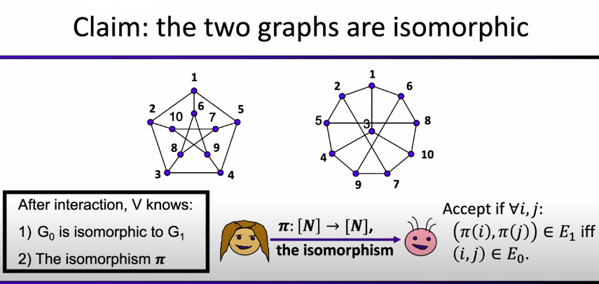

# Introduction and History of ZKP
## Introduction
Presentator : Shafi Goldwasser

This introduction will be on Zero Knowledge Interactive Proofs.
In our case, we take a proof as an interaction between a Prover and a Verifier.

There are :
    - a prover : that will prove a statement to the verifier
    - a verifier : that will accept or reject the proof
    - a claim : that is known from both Verifier and Prover
    - a proof : refers to a string, generated by the prover

### Efficiently Verifiable Proofs (NP-Proofs)
The prover works hard, to make the verifier time a polynomial time.

#### Examples of non ZK Proof
##### Claim: N is a product of 2 large primes

Verifier:
    - If N=pq, Verifier accepts
    - Else Verifier rejects

The proof would be proof={p,q}.

After interaction, Verifier knows:
    1 - N is product of 2 primes
    2 - The two primes p and q as N = p*q

This statement is non ZK because verifier knows p and q after interaction.

##### Claim: y is a quadratic residue mod N

Verifier:
    - If y=x² mod N, Verifier accepts
    - Else he rejects

The non ZK proof would be x.
Verifier can then verify that y = x² mod N.

After interaction, Verifier knows:
    1 - y is a quadratic residue mod N
    2 - Square root of y (hard problem equivalent to factoring N)

This is non ZK because verifier knows x after interaction.

##### Claim : the two graphs are isomorphic
"isomorphic" means that they are equivalent, just drawn a little differently.

#### NP-Languages

Completeness = all true statements have a witness (proof)
Soundness = none false statement have a witness (proof)

### Zero Knowledge Proofs : Yes
The main idea is to prove that I cloud prove it if I felt like it.

#### Two New Ingedients
- Interaction : Verifier and prover can interact, rather than passively "reading" proof
- Randomness : Verifier is randomized

#### Interactive Proof Model
This model is probabilistic.

##### Let's take an example
Claim: A page contains 2 combined colors.
Verifier: is blind, so he can't see colors.

The verifier flips a coin, if heads he flips the page over, otherwise he doesn't.
Then, he sends the resulting page to the Prover.
The prover can then tell the resulting color and deduce the coin result (heads or tails).

For a single round, the probability to guess the valid answer is 1/2.

But for k round, the probability becomes 1/2^k, which is really hard to cheat if k is big enough.

##### Interactive Proof for Quadratic Residue

##### Notation
For all cheating prover strategy, Verifier will not accept except with negligible probability.

 
 ### Zero Knowledge : Definition

This definition should apply even if a Verifier is not honest.

