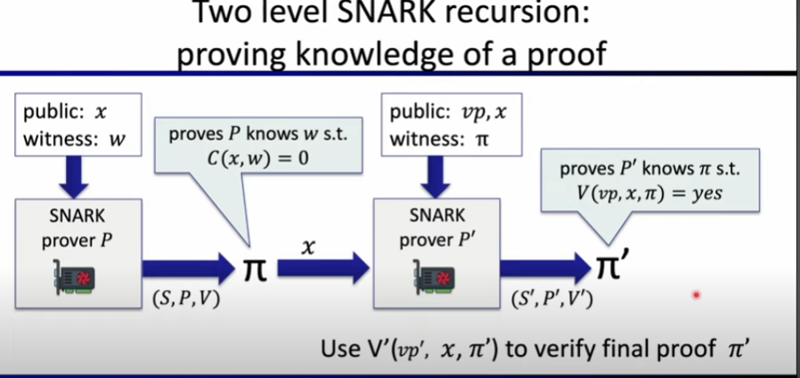
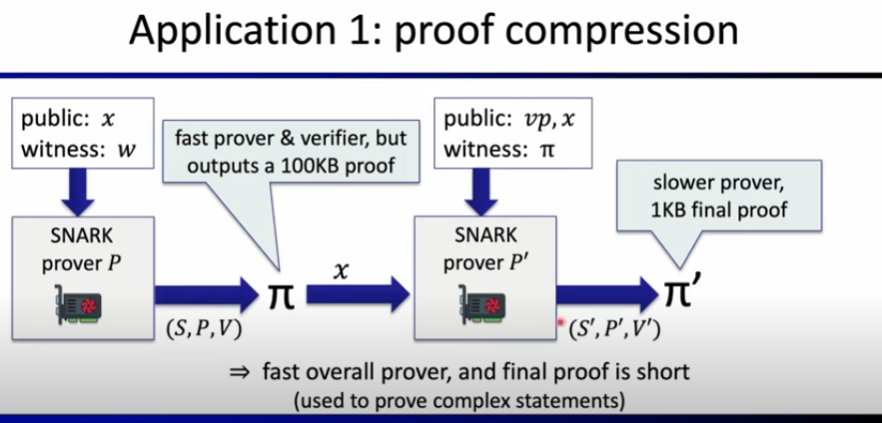
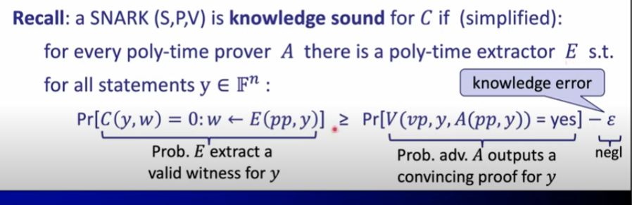
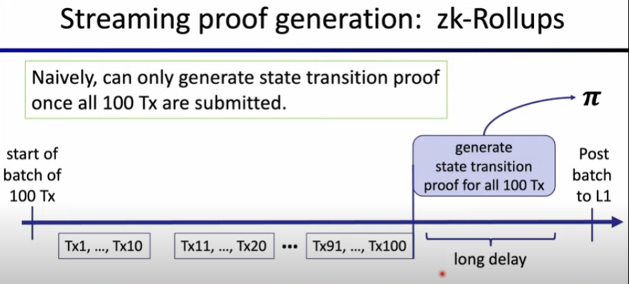
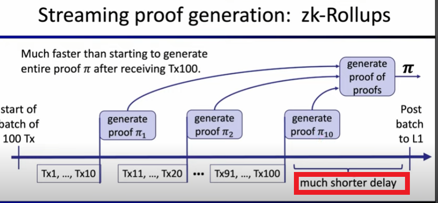

# Recursive SNARKs
Lecturer: Dan Boneh

## Recall: SNARK algorithms
A **preprocessing SNARK is a triple (S,P,V):
- $S(C) \rightarrow$ public parameters $(pp, vp)$ for prover and verifier
- $P(pp, x, w) \rightarrow$ proof $\pi$
- $V(vp, x, \pi) \rightarrow$ accept OR reject

## SNARK types
- Groth16, Plonk-KZG:
  - short proofs, but prover time is $O(n log(n))$
- FRI-based proofs

## Two level SNARK recursion: proving knowledge of a proof
We prove that **we know a proof of witness** $w$.

### Application 1: proof compression

If $C$ is really really big, then if we want a short proof, the time will be really large. So we can use a first system that will be fast in time but outputs a big size proof. Then the big size proof is going through a short size proof system, with a reasonable time computing.

Then, if the verifier wants to verify that $w$ exists, he will verify the recursive proofs.

#### Why is this sound?
fix a circuit: $C: \mathbb{F}^n \times \mathbb{F}^m \rightarrow \mathbb{F}$

**Recall**: knowledge sound if:

For the explanation, see slides in `Lecture10\lecture10.pdf`.

### Application 2: streaming proof generation

A typical prover (e.g., for zk-Rollup):
- Collect statements $(x_1, w_1), ..., (x_n, w_n)$ from the public (e.g., Transaction on a blockchain).
- Prove a conjunction: $C(x_1, w_1) = ... = C(x_n, w_n) = 0$

**The problem:** need all $n$ statements before can begin to build proof

Can we generate the proof in a streaming fashion?
- **Goal:** begin to generate proof as soon as $(x_1, w_1)$ is available

### Other application
For the other application, see slides in `Lecture10\lecture10.pdf`.

### Application: Incrementally Verifiable Computation (IVC)
Witnesses are created for several steps.
Applications of IVC:
- 1. Break a long computation into a sequence of small steps (microproc step for example)
- 2. Succint proof that current state of blockchain is correct (Mina Blockchain)
- 3. Verifiable Delay Function: succent proof that $s_n$ is equal to H^{(n)}(s_0)$

### Summary
As a summary, recursive SNARKs allows us to make intermediate statement proofs. The verifier will then need to verify the proofs until he gets to an intermediate proof he trust.

## Chosing Curves to support recursion