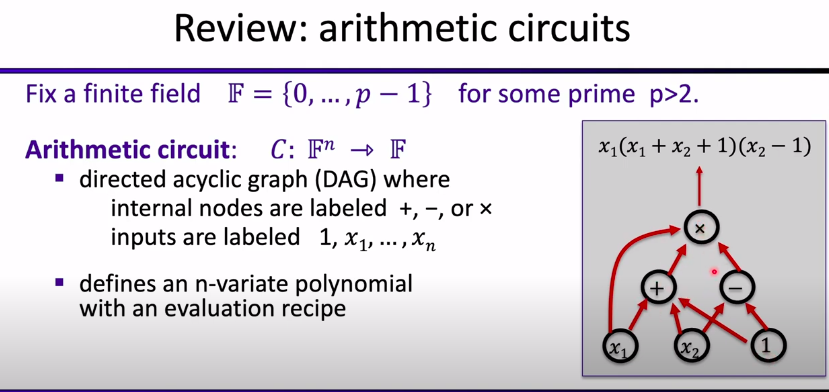
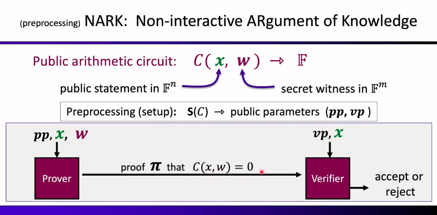
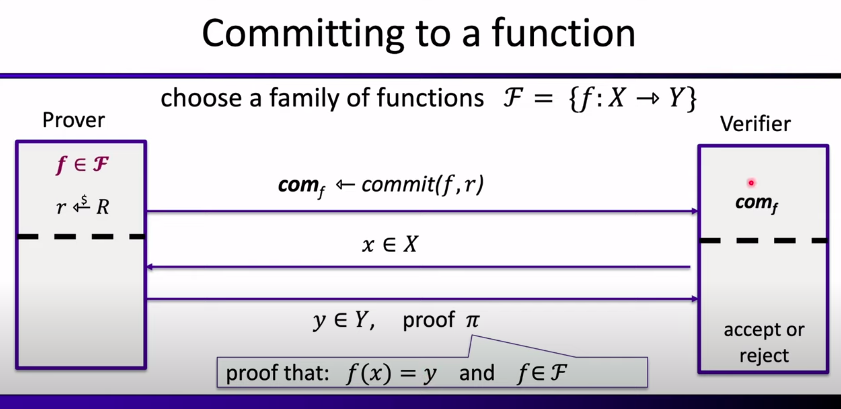

# Overview of Modern SNARK Constructions
Presentator : Dan Boneh

## Part1 - Introduction

### What is a zk-SNARK? (intuition)
SNARK = a **succint** proof that a certain statement is true

Example statement : "I know a message m such that SHA256(m) = 0"

SNARK means that the proof is "short" and "fast" to verify.
The trivial proof (which would be the message m) is neither "short" or "fast" to verify if m is 1GB.
The SNARK allows both even if message m is 1GB.

A zk-SNARK means that the proof "reveals nothing" about the message m. Privacy is respected for m.

### Commercial interest in SNARKs
#### Companies
There are a lot of companies that are interested in SNARKs :
* Some companies are building SNARKs (StarkWare, Aztec, MatterLabs, Espresso Systems, ...)
* Others are using SNARKs (RISC Zero, Scroll, Polygon, Aleo, ...)
* Several companies are building hardware accelerators for SNARKs (SupraNational, Ingonyama)

#### Why so much commercial interest?
"With SNARKs, a slow and expensive computer can monitor the operation of a herd of GPUs working with unreliable software."

"a slow and expensive computer" can be replaced by "L1 blockchains", which are known to be expensive and slow.

### Blockchain Applications
The objective is to use outsourcing computation $\rightarrow$ L1 chain quickly verifies the work of an off-chain service.

#### Examples of SNARKs
For the following examples, it is crucial that the proof is non-interactive.
##### Scalability: proof-based Rollups (zkRollup)
    - Off-chain service processes a batch of Tx (transactions)
    - L1 Chain verifies a succint proof (SNARKs) that Tx were processed correctly

##### Bridging blockchains: proof of consensus (zkBridge)
    - enables transfer of assets from one chain to another

#### Examples of zk-SNARKs
##### Private Tx on a public blockchain
    - zk proof that a private transaction is valid
    - application examples : Tornado Cash, Zcash, IronFish, Aleo

##### Compliance
    - Proof that a private Tx is compliant with banking laws (Espresso)
    - Proof that an exchange is solvent in ZK (Raposa)

### Non-blockchain applications
Today, Blockchains are driving the development of SNARKs.
But there are many non-blockchain applications !!!

#### Using ZK to fight disinformation
The Russia-Ukraine conflict has showed that disinformation can be widely used, especially with fake pictures.

C2PA is a standard that is used to sign the metadata of a picture when it is taken. The signing key can't be extracted from the embedded device. The signature can then be verified to authenticate picture metadata.

The problem with C2PA is that it does not allow post-processing. For example, the image can be :
* Resized
* Cropped
* Grayscaled
* ...

The metadata and signature will no longer be valid.

The metadata will still be valid, because post-processing would be sort of "verified" by a zk-SNARKs.

### Why are these applications possible now?
    - new fast SNARK provers
    - Proof generation time is linear (or quasilinear) in computation size

## Part2 - What is a SNARK?
### Review: arithmetic circuits
First, fix a finite field F={0,1,...,p-1} for some prime p > 2.

Then, take an arithmetic circuit.

Arithmetic circuit : a function that takes n elements of the field F as inputs, and produces an element of the field F as output.

The arithmetic circuit C defines an n-variate polynomial with an evaluation recipe.

*Note:* |C| = number of gates in the circuit C

### Interesting arithmetic circuits
SHA256 can be transformed to an arithmetic circuit.

$C_{sha}(h,m)$ : outputs 0 if SHA256(m) = h, and !=0 otherwise

$C_{sha}(h,m) = (h - SHA256(m))$ , with $\|Csha\| \approx 20K gates$ \
This 20K gates circuit is considered a small arithmetic circuit.

A more complicated circuit can be one that verifies if ECDSA signature is a valid one.

$C_{sign}(pk, m, sig)$ : outputs 0 if sig is a valid ECDSA signature on m with respect to pk

### Structured vs Unstructured circuits
* An unstructured circuit: a circuit with arbitrary wires
* A structured circuit: an example is one step of a processor

Some SNARK techniques are general and apply to unstructured circuits, but others only apply to structured circuits.

### NARK - Non-interactive ARgument of Knowledge

* x = public statement in field Fn
* w = secret witness in field Fm

A preprocessing NARK is a triple (S, P, V):
* S(C) : outputs public parameters (pp, vp) for prover (pp) and verifier (vp)
* P(pp, x, w) : outputs proof $\pi$
* V(vp, x, $\pi$) : accept or reject the proof

*Note:* all algorithms and adversary have access to a random oracle
#### NARK - requirements
##### Completeness
Completeness : $$\forall x,w: C(x,w) = 0  \Rightarrow Pr[V(vp,x,P(pp,x,w))=accept]=1$$

##### Soundness
Adaptively knowledge sound :
$V$ accepts $\rightarrow P$ "knows" $w$ such that $C(x,w)=0$ (an extractor $E$ can extract a valid $w$ from $P$)

##### Optional : ZK
$(C, pp, vp, x, \pi)$ elements "reveal nothing new" about w

The trivial NARK proof would be $\pi = w$. So the verifier will be able to verify statement, but will know $w$. The ZK property will not be satisfied.

### SNARK - Succint Non-interactive ARgument of Knowledge
A succint preprocessing NARK is a triple (S, P, V):
* S(C) : outputs public parameters (pp, vp) for prover (pp) and verifier (vp)
* P(pp, x, w) : outputs **short** proof $\pi$ ; $len(\pi) = sublinear(|w|)$
* V(vp, x, $\pi$) : accept or reject the proof but **fast to verify** ; $time(V) = O\lambda(|x|, sublinear(|C|))$

Example sublinear function : f(n) = $\sqrt(n)$

But now, we would like **strongly succint** preprocessing NARK. It is a triple (S, P, V) :
* S(C) : outputs public parameters (pp, vp) for prover (pp) and verifier (vp)
* P(pp, x, w) : outputs **short** proof $\pi$ ; $len(\pi) = log(|C|)$ 
* V(vp, x, $\pi$) : accept or reject the proof but **fast to verify** ; $time(V) = O\lambda(|x|, log(|C|))$

Remarks :
* V has no time to read C !!!
* vp contains a short "summary" of circuit

The verifier doesn't know the underlying circuit. The verifier parameter does include a "summary" of the cricuit. This allows the verification time to be $log(\|C\|)$ without compromising verification.

zk-SNARK is a SNARK that is zero-knowledge.

#### The trivial SNARK is not a SNARK
- a - Prover sends w to verifier
- b - Verifier checks if C(x,w)=0 and accepts if so

Problem with this :
* 1 - w might be long: we want a "short" proof
* 2 - computing C(x,w) may be hard: we want a "fast" verifier
* 3 - w might be secret: prover might not want to reveal w to verifier (zk)

#### Types of preprocessing Setup

Setup for circuit C: $S(C;r) = (pp,vp)$ public parameters, with r some random bits

Types of setup (ranked from the worst to the best):
-   **trusted setup per circuit:** S(C;r) random r must be kept secret from prover. If prover learns r, he can prove false statements. "Trusted setup ceremony" is a way to show that r will not be stored anywhere, but we like to avoid them as much as we can.
-   **trusted but univesal (updatable) setup:** secret r is independent of C. $S=(S_{init}, S_{index}): S_{init}(\lambda; r) \rightarrow gp, S_{index}(gp, C) \rightarrow (pp,vp)$. With $S_{init}$ a one-time setup and a secret r. With $S_{index}$ a deterministic algorithm. "gp" is called "global parameter".
-   **transparent setup:** S(C) does not use secret data (no trusted setup). 

The main difference is that the second setup needs to be run only once to support every circuit. The first setup will need to be run one time per circuit. The third one does not use secret data as input.

#### Significant progress in recent years

*Note:* Following data are given for a circuit with $\approx 2^{20}$ gates.

|Algorithm|size of proof $\pi$|verifier time| setup | Post-Quantum ? |
|---|---|---|---|---|
|Groth'16|$\approx 200$ Bytes   $O_{\lambda}(1)$|$\approx 1.5$ ms   $O_{\lambda}(1)$ |trusted per circuit|No|
|Plonk / Marlin|$\approx 400$ Bytes   $O_{\lambda}(1)$|$\approx 3$ ms   $O_{\lambda}(1)$|universal trusted setup|No|
|Bulletproofs|$\approx 1.5$ KB   $O_{\lambda}(log(\|C\|))$|$\approx 3$ s   $O_{\lambda}(\|C\|)$ |transparent|No|
|STARK|$\approx 100$ KB   $O_{\lambda}(log²(\|C\|))$|$\approx 10$ ms   $O_{\lambda}(log²(\|C\|))$|transparent|yes|

Here : Prover time is almost linear in |C|.

#### How to define knowledge soundness
**Goal:** if $V$ accepts then $P$ "knows" $w$ such that $C(x,w)=0$

**What does it mean to "know" w ?**

An informal definition: $P$ knows $w$, if $w$ can be "extracted" from $P$

**Formal definition:** \
$(S, P, V)$ is (adaptively) **knowledge sound** for a circuit $C$ if for every polynomial time adversary $A=(A_0, A_1)$ such that : \
$$gp \leftarrow S_{init}(), (C,x,st) \leftarrow A_0(gp), (pp,vp) \leftarrow S_{index}(C), \pi \leftarrow A_1(pp, x, st) :$$
$ Pr[V(vp,x,\pi) = accept] > 1/10^6 $ (non-negligible)

Then there is an efficient **extractor E** (that uses A) such that :
$$gp \leftarrow S_{init}(), (C,x,st) \leftarrow A_0(gp), w \leftarrow E(gp, C, x) :$$
$Pr[C(x,w)=0] > 1/10^6 - \epsilon $ (for a negligible $\epsilon$)

## Part3 - Building an efficient
### General paradigm: two steps
1 - A functional commitment scheme: a cryptographic object

2 - A compatible interactive oracle proof (IOP): information theoretic object

These 2 steps gathered output a SNARK for general circuits.

#### Review: commitments
Two algorithms: 
-   $commit(m,r) \rightarrow com$ (with r chosen at random)
-   $verify(m, com, r) \rightarrow$ accept or rejet

The commitment scheme must have 2 properties:
-   binding: cannot produce $com$ and two valid openings for $com$
-   hiding: $com$ reveals nothing about committed data

##### A standard construction
Fix a hash function $H: M * R \rightarrow T$
-   $commit(m,r): com := H(m,r)$
-   $verify(m, com, r):$ accept if $com = H(m,r)$

Hiding and Binding for a suitable function H

##### Commiting to a function

The function f can be a circuit, a C program, ...
The commitment $com_f$ 

A **functional commitment** scheme for $F$:
* $setup(1^{\lambda}) \rightarrow gp$, outputs public parameters gp
* $commit(gp, f, r) \rightarrow com_f$, commitment to $f \in F$ with $r \in R$. \
This "commit" algorithm is supposed to be a binding (and optionnaly hiding if ZK) commitment scheme for $F$.
* $eval(Prover\ P, Verifier V)$: for a given $com_f$ and $x \in X, y \in Y$ :
  * $P(gp, f, x, y, r) \rightarrow (short\ proof)\ \pi$
  * $V(gp, com_f, x, y, \pi) \rightarrow $ accept/reject

*Note:* the verifier does not know the function f, but know a commitment $com_f$ to this function f.

This is a **(zk)SNARK** for the relation:
* $f(x) = y$ and $f \in F$ and $commit(gp, f, r) = com_f$

The public statement here is:
* the commitment string $com_f$
* the value $x$
* the value $y$

What the prover is proving is:
* he knows a witness: it knows the description of the function $f$ and some random $r$ such that :
  * $f(x) = y$
  * $f \in F$
  * $commit(gp, f, r) = com_f$

##### Four important functional commitments
* **Polynomial commitments:** commit to a univariate $f(X)$ in $F_p^{(\leqslant d)}[X]$
  * The degree is at most $d$

* **Multilinear commitments:** commit to multilinear $f$ in $F_p^{(\leqslant 1)}[X_1,...,X_k]$
  * e.g., $f(x_1,...,x_k) = x_1 x_3 + x_1 x_4 x_5 + x_7$

* **Vector commitments (e.g., Merkle trees):**
  * Commit to $\overrightarrow{u} = (u_1,..., u_d) \in F_p^d$
  * Open cells: $f_{\overrightarrow{u}}(i)=u_i$, with $i$ the index of a vector

* **Inner product commitments** (or Inner Product Arguments - IPA) **:**
  * Commit to $\overrightarrow{u} \in F_p^d$
  * Open an inner product: $f_{\overrightarrow{u}}(\overrightarrow{v}) = (\overrightarrow{u},\overrightarrow{v})$

##### Let's look a polynomial commitments
Prover commits to a polynomial $f(X)$ in $F_p^{(\leqslant d)}[X]$
* **eval:** for public $u,v \in F_p$, prover can convince the verifier that committed polynomial satisfies :
  * $f(u) = v$ and $deg(f) \leqslant d$

*Note:* verifier has $(d, com_f, u, v)$

* Eval proof size and verifier time should be $ O\lambda(d) $

**A few examples:**
* Using bilinear groups: KZG'10 (trusted setup needed), Dory'20, ...
* Using hash functions only: based on FRI (long eval proofs)
* Using elliptic curves: Bulletproofs (short proof, but verifier time is $O(d)$
* Using groups of unknown order: Dark'20

*Note:* KZG'10 is the most widely used polynomial commitment scheme.

###### The trivial commitment scheme is not a polynomial commitment
* $commit(f = \sum_{i=0}^d a_i X^i, r)$ : output $com_f \leftarrow H((a_0, ..., a_d), r)$
* eval: prover send $\pi = ((a_0, ..., a_d), r) to verifier
  * verifier accepts if $f(u) = v$ and $H((a_0, ..., a_d), r) = com_f$
**The problem:** the proof $\pi$ is not succint. Proof size and verification time are **linear** in $d$.

*Note:* 