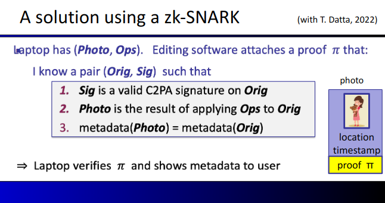

# Introduction and History of ZKP
Presentator : Dan Boneh

## What is a zk-SNARK? (intuition)
SNARK = a **succint** proof that a certain statement is true

Example statement : "I know a message m such that SHA256(m) = 0"

SNARK means that the proof is "short" and "fast" to verify

The trivial proof (which would be the message m) is neither "short" or "fast" to verify if m is 1GB.

The SNARK allows both even if message m is 1GB.

A zk-SNARK means that the proof "reveals nothing" about the message m. Privacy is respected for m.

## Commercial interest in SNARKs
### Companies
There are a lot of companies that are interested in SNARKs :
    - Some companies are building SNARKs (StarkWare, Aztec, MatterLabs, Espresso Systems, ...)
    - Others are using SNARKs (RISC Zero, Scroll, Polygon, Aleo, ...)
    - Several companies are building hardware accelerators for SNARKs (SupraNational, Ingonyama)

### Why so much commercial interest?
"With SNARKs, a slow and expensive computer can monitor the operation of a herd of GPUs working with unreliable software."

"a slow and expensive computer" can be replaced by "L1 blockchains", which are known to be expensive and slow.

## Blockchain Applications
The objective is to use outsourcing computation --> L1 chain quickly verifies the work of an off-chain service.

### Examples of SNARKs
For the following examples, it is crucial that the proof is non-interactive.
#### Scalability: proof-based Rollups (zkRollup)
    - Off-chain service processes a batch of Tx (transactions)
    - L1 Chain verifies a succint proof (SNARKs) that Tx were processed correctly

#### Bridgind blockchains: proof of consensus (zkBridge)
    - enables transfer of assets from one chain to another

### Examples of zk-SNARKs
#### Private Tx on a public blockchain
    - zk proof that a private transaction is valid
    - application examples : Tornado Cash, Zcash, IronFish, Aleo

#### Compliance
    - Proof that a private Tx is compliant with banking laws (Espresso)
    - Proof that an exchange is solvent in ZK (Raposa)

## Non-blockchain applications
Today, Blockchains are driving the development of SNARKs.

But there are many non-blockchain applications !!!

### Using ZK to fight disinformation
The Russia-Ukraine conflict has showed that disinformation can be widely used, especially with fake pictures.

C2PA is a standard that is used to sign the metadata of a picture when it is taken. The signing key can't be extracted from the embedded device. The signature can then be verified to authenticate picture metadata.

The problem with C2PA is that it does not allow post-processing. For example, the image can be :
    - Resized
    - Cropped
    - Grayscaled
    - ...

The metadata and signature will no longer be valid.

The metadata will still be valid, because post-processing would be sort of "verified" by a zk-SNARKs.

## Why are these applications possible now?
    - new fast SNARK provers
    - Proof generation time is linear (or quasilinear) in computation size

