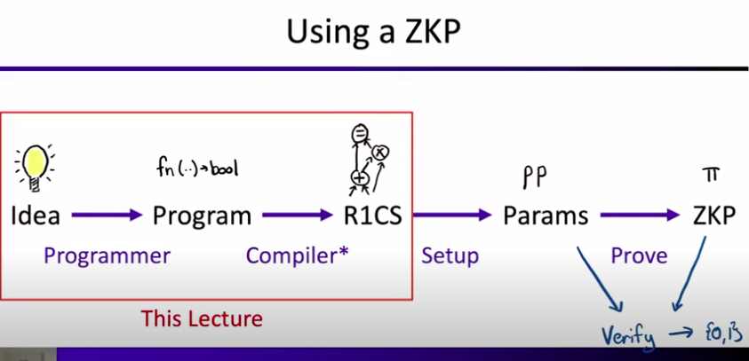
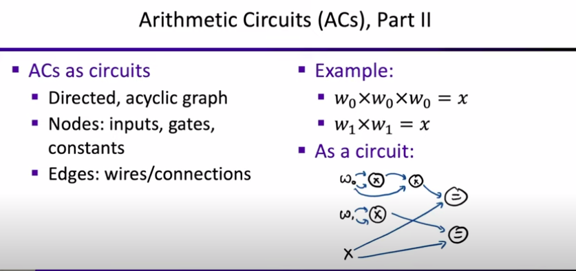
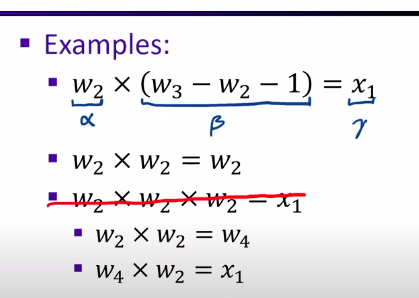
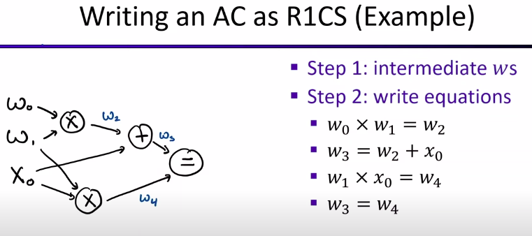
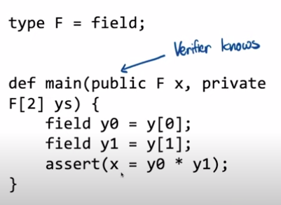
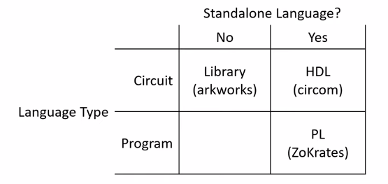
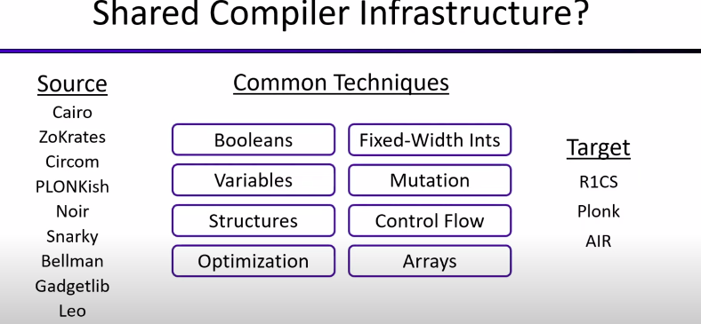
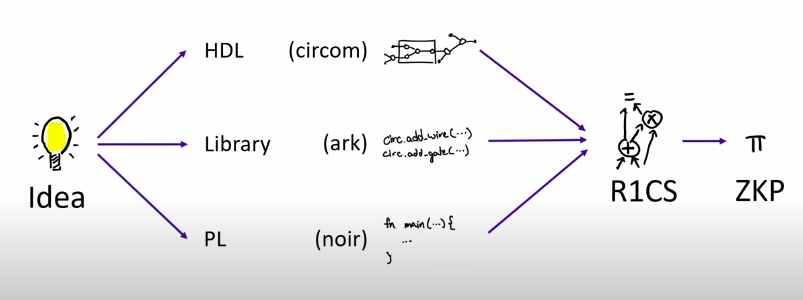

# Libraries and Compilers to build ZKP
## Programming ZKPs
Guest Lecturers: Pratyush Mishra and Alex Ozdemir

### Using a ZKP



### Summary
- Big Picture: ZKP Programmability
- Using an HDL - Hardware Description Language (+ tutorial)
- Using a library (+ tutorial)
- Using a compiler (+ tutorial)
- An overview of prominent ZKP toolchains


### ZKP Programmibility
#### Recap: ZKPs for a predicate 
Prover knows $\phi, x, w$
Verifier knows $\phi, x$

Proof $\pi$ shows that $\phi(x,w)$
  - But does not reveal $w$

**Key Question:** what can $\phi$ be ?

#### What is $\phi$
$\phi$ in theory: $\phi$ can be any NP-statement.
- $w$ is a factorization of integer $x$
- $w$ is the secret key for public key $x$
- $w$ is the credential for account $x$
- $w$ is a valid transaction

$\phi$ in pratice
- $\phi$ is an "arithmetic circuit" over inputs $x, w$

#### Arithmetic Circuits (ACs), Part 1
Domain: "prime field"
- p: a large prime ($\approx 255$ bits)
- $Z_p$: the integers, mod $p$
  - operations: $+,\times,=$(mod $p$)
- Example in $Z_5$:
  - $4+5 = 9 = 4$
  - $4 \times 4 = 16 = 1$

ACs as systems of field equations:
- $w_0 \times w_0 \times w_0 = x$
- $w_1 \times w_1 = x$
- Addition is also OK

#### Arithmetic Circuits (ACs), Part 2




This is one format which a ZKP understands.

#### Rank-1 Constraint Systems (R1CS)
R1CS is another format which a ZKP understands.

- R1CS: format for ZKP ACs
- Definition:
  - $x$: field elements $x_1, ..., x_l$
  - $w$: $w_1, ..., w_{m-l-1}$
  - $\phi$: $n$ equations of form
    - $\alpha \times \beta = \gamma$
    - where $\alpha, \beta, \gamma$ are affine combinations of variables
- Examples:



Note: it is possible to encode the $w_2 \times w_2 \times w_2 = x_1$ using **multiple** Rank-1 Constraint.

#### R1CS: Matrix definition
- $x$: vector of $l$ field elements
- $w$: vector of $m-l-1$ field elements
- $\phi$: matrices $A,B,C \in Z_p^{n \times m}$
  - $z = (1 \| x \| w) \in Z_p^{m}$
  - Holds when $Az \circ Bz = Cz$ with $\circ$ the element-wise product

Explanation between this definition and R1CS :
    - The matrix product $A \times z$ takes $z$ and computes the inner product of every row of $A$
    - It means that every row of $A$ is defining an affine combination of the variables in $x$ and $w$ ($z$)
    - The number of rows n in $A,B,C$ is the exact number of Rank-1 Constraint
    - The width m is one more the total number of variables because the $z$ vector includes a constant variable (probably 1)

#### Writing an AC as R1CS (Example)


We have the resulting equations:
  - $w_0 \times w_1 = w_2$
  - $w_3 = w_2 + x_0$
  - $w_1 \times x_0 = w_4$
  - $w_3 = w_4$

#### Zooming out: a Programming Languages problem
High-level specification for $\phi$ $\Longrightarrow$ R1CS

Program in high-level language $\Longrightarrow$ Assembly

To do this, we use:
- Libraries
- Compilers
- Programming Languages
- Domain Specific Languages
- ...

#### The idea
- High-level code
  - Booleans
  - Structures
  - Modules
  - Functions
  - ...
- Compiler/Library
- R1CS
- ZK Proof System

#### An example
The given example follows the idea described before:


### An HDL for R1CS
**HDL:** Hardware Description Language

#### First tutorial
Circom is a HDL for R1CS.

##### Programming Languages (PL) VS Hardware Description Languages (HDL)

PL objects:
- Variables
- Operations
- Program/Functions

PL actions:
- Mutate variables
- Call functions


HDL objects:
- Wires
- Gates
- Circuit/Sub-circuits

HDL actions:
- Connect wires
- Create sub-circuits

##### HDL: From Digital to Arithmetic
HDL for Digital Circuits:
- Verilog: an HDL used to model electronic systems and digital circuits
- SystemVerilog: Verilog was merged into the SystemVerilog standard
- VHDL
- Chisel
- ...

For example, the processor of a computer was designed using an HDL.

HDL for R1CS:
- Circom
  - wires: R1CS variables
  - gates: R1CS constraints
- a Circom circuit does 2 things:
  - sets variable values
  - creates R1CS constraints

##### Circom: Base Language
- A "template" is a (sub)circuit
- A "signal" is a wire
  - "input" or "output"
- "<--" sets signal values
- "===" creates constraints
  - Must be rank-1
    - one side: linear
    - other side: quadratic
- "<==" does both
- component main should be declared, and public signal needs to be declared. Output is always public. Input is private unless you say otherwise.
```
template Multiply() {
  signal input x;
  signal input y;
  signal output z;

  z <-- x * y;
  z === x * y;

  //ERROR: z === x * x * y;

  // Equivalent to the two last lines:
  z <== x * y;
}
component main {public [x]} = Multiply;
```

So verifier will know $x$ and $z$.

##### Circom: Metaprogramming Language
- Template arguments
- Signal arrays
- Variables
  - Mutable
  - Not signals
  - Evaluated at compile-time
- Loops

```
template RepeatedSquaring(n) {
  signal input x;
  signal output y;

  signal xs[n+1];
  xs[0] <== x;
  for (var i = 0; i < n; i++) {
    xs[i+1] <== xs[i] * xs[i];
  }
  y <== xs[n];
}

component main {public [x]} = RepeatedSquaring(1000);
```

##### Circom: Witness Computation & Sub-circuits
- Witness computation: more general than R1CS
  - "<--" is more general than "==="
- "component"s hold sub-circuits
  - Access inputs/outputs with dot-notation
```
template NonZero() {
  signal input in;
  signal inverse;
  inverse <-- 1 / in; // This is not R1CS, but can be used as computation
  1 === in * inverse; // is R1CS
}

template Main () {
  signal input a;
  signal input b;
  component nz = NonZero();
  nz.in <== a;
  0 === a * b;
}
```

#### Tutorial Example: Sudoku
- 9 by 9 grid
- Some cells have #s
- Goal: fill all cells with 1..9
- Rule: no duplicates in any:
  - Column
  - Row
  - 3x3 sub-grid

So here:
- $\phi$ is the rules
- $x$ is the puzzle
- $w$ is the solution

#### Recap
- An HDL for R1CS
- Key features
  - Direct control over constraints
  - Custom language
    - Can be good
    - Can be bad

### A library for R1CS
- A library in a **host** language (like Rust, C++, Go, ...)
- Key type: constraint system
  - Maintains state about R1CS constraints and variables
- Key operations:
  - create variable
  - create linear combinations of variables
  - add constraint

#### ConstraintSystem operations
**Variable creation**
- cs.add_var(p, v) -> id
- cs: constraint system
- p: visibility of variable
- v: assigned value
- id: variable handle

**Linear Combination creation**
- cs.zero(): returns the empty LC (Linear Combination)
- lc.add(c, id) -> lc'
  - id: variable
  - c: coefficient
  - lc' := lc + c * id

**Adding constraints**
- cs.constrain($lc_A, lc_B, lc_C$)
  - Adds a constraint $lc_A \times lc_B = lc_C$

#### Example: Boolean AND
Note that it is **Boolean AND**, and not int or other.
```rust
fn and(cs: ConstraintSystem, a: Var, b: Var) -> Var {
  let result = cs.new_witness_var(|| a.value() & b.value());
  self.cs.enforce_constraint(
    lc!() + a,
    lc!() + b,
    lc!() + result,
  );
  result
}
```

#### Idea: Leverage Language Abstractions!
We can use language abstractions like structs, operator, overloading, methods, etc. to allow better developer UX:

```rust
struct Boolean {var: Var};

impl BitAnd for Boolean {
  fn and(self: Boolean, other: Boolean) -> Boolean {
    //same code as before (Boolean AND)
    Boolean { var: result }
  }
}

```

Now we will be able to use high level syntax.
We can use abstractions like normal code:
```rust
let a = Boolean::new_witness(|| true);
let b = Boolean::new_witness(|| false);
(a & b).enforce_equal(Boolean::FALSE);
```

There are many different gadget libraries:
- libsnark: gadgetlib (C++)
- arkworks: r1cs-std + crypto-primitives (Rust)
- Snarky (Ocaml)
- Gnark (Go)

#### What about Witness Computation
- Can perform arbitrary computations to generate witnesses
```rust
let a = Boolean::new_witness(|| (4 == 5) & (x < y));
let b = Boolean::new_witness(|| false);
(a & b).enforce_equal(Boolean::FALSE);
```

#### HDLs & Circuit Libraries
**Differences**
- Host language VS custom language
**Similarities**
- explicit wire creation (explicitly wire values)
- explicit constraint creation

The question is: "Do we need to explicitly build a circuit?" --> NO

### Compiling a Programming Language to R1CS
#### Compiling Programming Language to Circuits
We take a program with:
- Variables
- Mutation
- Functions
- Arrays

We take it through a compiler and get a R1CS with wires and constraints.

#### ZoKrates: Syntax
- Struct syntax for custom types
- Variables contain values during execution/proving
- Can annotate privacy (what does the verifier know and doesn't)
- "assert" creates constraints



#### Zokrates: Language features
- Integer generics (like function on number)
- Arrays
- Variables
  - Mutable
- Fixed-length loops
- If expressions
- Array accesses

#### What about Witness Computation?
- No way to compute witnesses
- All witnesses must be provided as input


#### Zokrates: Tutorial
See code


### ZKP Toolchains: A Quick Tour
We have seen 3 toolchain type:
- HDL: a language for describing circuit synthesis
  - Circom
- Library: a library for describing circuit synthesis
  - Arkworks (Rust)
  - Gadgetlib (C++)
  - Bellman (Rust)
  - Snarky (OCaml)
  - PLONKish (Rust)
- Programming Language + Compiler : a language, compiled to a circuit
  - ZoKrates
  - Noir
  - Leo
  - Cairo





#### Kind of Constraint Systems
- R1CS
- Plonk
- AIR




### Summary




