# SNARKs via Interactive Proofs
Lecturer: Justin Thaler

## Recall
### What is a SNARK?

**SNARK**: a succint proof that a certain statement is true (example: I know a message $m$ such that $SHA256(m) = 0$)

So, the proof is **"short"** and **"fast"** to verify.

## Interactive Proofs: Motivation and Model

- $P$ solves the problem and tells $V$ the answer
  - Then they have a conversation
  - $P$'s goal: convince $V$ that the answer is correct
- Requirements:
  - 1 - Completeness: an honest $P$ can convince $V$ to accept
  - 2 - (Statistical) Soundness: $V$ will catch a lying $P$ with high probability. 
    - This must hold even if $P$ is computationally unbounded and trying to trick V into accepting the incorrect answer.
    - If soundness holds only against polynomial-time provers, then the protocol is called an interactive **argument**.

**Soundness** and **Knowledge soundess** are different:
  - **Sound**: $V$ accepts $\rightarrow$ There exists $w$ such that $C(x,w) = 0$
  - **Knowledge sound**: $V$ accepts \rightarrow $P$ "knows" $w$ such that $C(x,w) = 0$

Standard soundness is meaningful even in contexts where knowledge soundness isn't:
  - Because there's no natural "witness"
  - For example, $P$ claims the output of $V$'s program on $x$ is $42$.

Likewise, knowledge soundness is meaningful in contexts where standard isn't:
  - e.g. $P$ claims to know the secret key that controls a certain bitcoin wallet

### Public Verifiability
- Interactive proofs and arguments only convince the party that is choosing/sending the random challenges.
- This is bad if there are many verifiers (as in most blockchain applications)
  - becayse $P$ would have to convince each verifier separately
- For public coin protocols, we have a solution: Fiat-Shamir
  - Makes the protocol non-interactive + publicly verifiable

## SNARKs from interactive proofs: outline
Actual SNARK: $P$ commits cryptographically to $w$
  - Uses an IP to prove that $w$ satisfies the claimed property
  - Reveals just enough information about the committed witness $w$ to allow $V$ to run its checks in the IP
  - Render non-interactive via Fiat-Shamir

### Review of functional commitments
Note: see previous courses for more details
- Polynomial commitments
- Multilinear commitments
- Vector commitments (e.g. Merkle Trees)

### Merkle Trees
- Commitment to vector is root hash
- To open an entry of the committed vector (leaf of the tree):
  - Send sibling hashes of all nodes on root-to-leaf path
  - $V$ checks these are consistent with the root hash
  - "Opening proof" size is $O(log(n))$ hash values

### Summary: commit to a univariate $f(X)$ in $F^{(\leqslant{d})} [X]$
- $P$ Merkle-commits to all evaluations of the polynomial $f$
- When $V$ requests $f(r)$, $P$ reveals the associated leaf along with opening information
- Two problems:
  - 1. The number of leaves is $|F|$, which means the time to compute the commitment is at least $|F|$
    - Big problem when working over large fields (say, $|F| \approx 2^{64}$ or $|F| \approx 2^{128}$)
    - Want time proportional to the degree bound $d$
  - 2. $V$ does not know if $f$ has degree at most $d$!
    - We'll explain how to address both issues later in the course

## Interactive proof design: Technical preliminaries
### Recap: SZDL Lemma
Recall **FACT**: Let $p \neq q$ be univariate polynomials of degree at most $d$. Then $Pr_{r \in F}[p(r)=q(r)] \leqslant{\frac{d}{|F]}}$

The **Schwartz-Zippel-Demillo-Lipton lemma** is a multivariate generalization:
  - Let $p\neq q$ be $l$-variate polynomiales of total degree at most $d$. Then, $Pr_{r \in F^l}[p(r)=q(r)] \leqslant{\frac{d}{|F]}}$
  - "Total degree" regers to the maximum sum of degrees of all variables in any term. E.g., $x_1^2 x_2 + x_1 x_2$ has a total degree 3 (because the first term which is $x_1^2 x_2$ is degree 3, and the second one is degree 2).

### Low-Degree and Multilinear Extensions
- Definition of Extensions: Given a function $f:\{0,1\}^l \rightarrow F$, a $l$-variate polynomial $g$ over $F$ is said to **extend** $f$ if $f(x) = g(x)$ for all $x \in \{0,1\}^l$.
- Definition of Multinlinear Extensions: Any function $f:\{0,1\}^l \rightarrow F$ has a **unique** multilinear extension (MLE), denoted $\widetilde{f}$.
  - Multilinear means the polynomial has degree at most 1 in each variable.
  - $(1-x_1)(1-x_2)$ is multilinear, and $x_1^2 x_2$ is not.

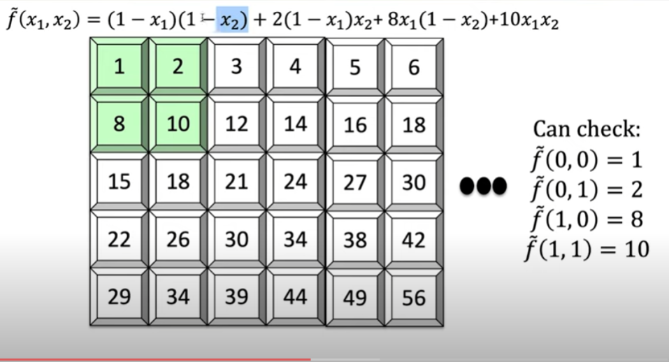

We can see that, using the "Lagrange interpolation".

Another (non-mutlilinear) extension of $f$: 
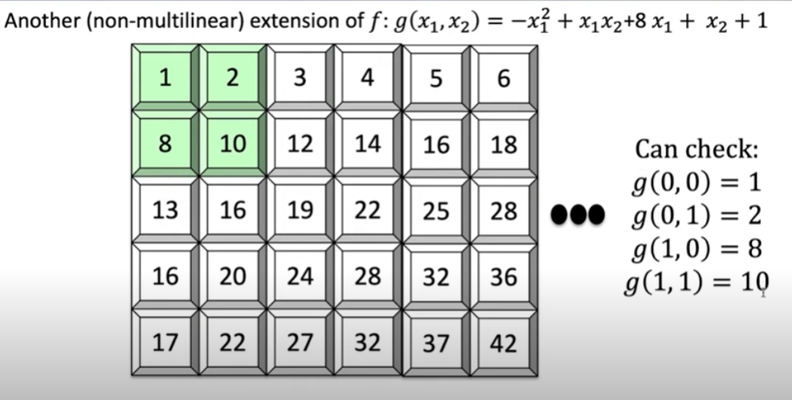

This is called a Quadratic Extension of $f$. It has the correct behaviour.

The multilinear extension is used because, if one input is not the good one, then the multilinear extension disagree at almost all inputs in $F^l$. This will be explained later.

#### Evaluating multilinear extensions quickly
- Fact: Given as input all $2^l$ evaluations of a function $f:\{0,1\}^l \rightarrow F$, for any point $r \in F^l$ there is an $O(2^l)$-time algorithm for evaluating $\widetilde{f}(r)$.
  - Sketch: Use Lagrange interpolation.

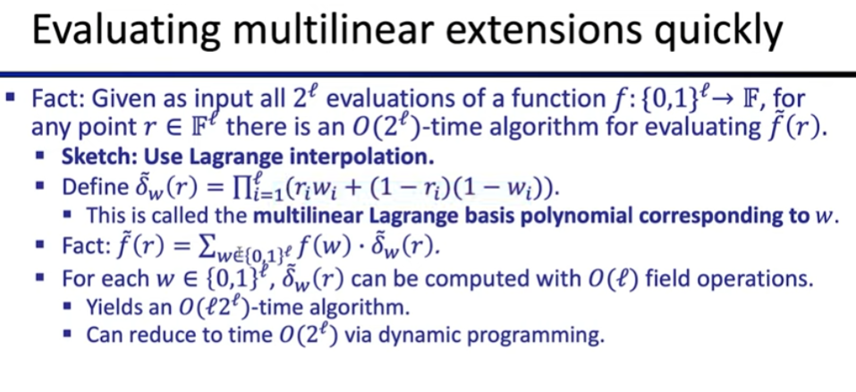

## The sum-check protocol

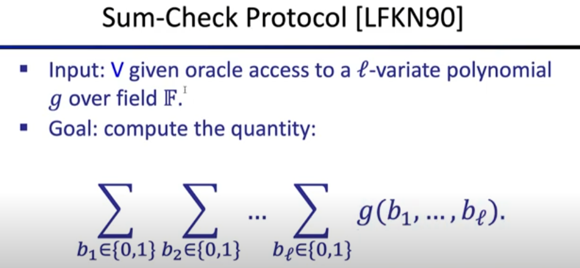

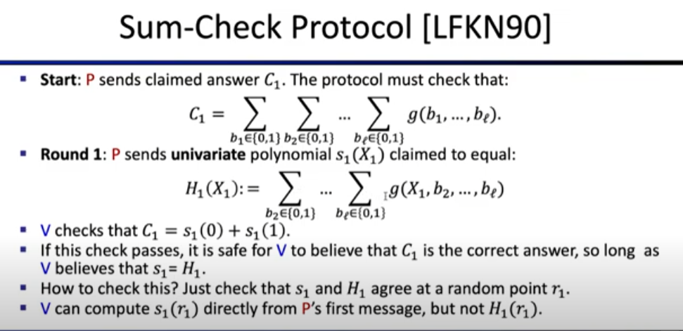

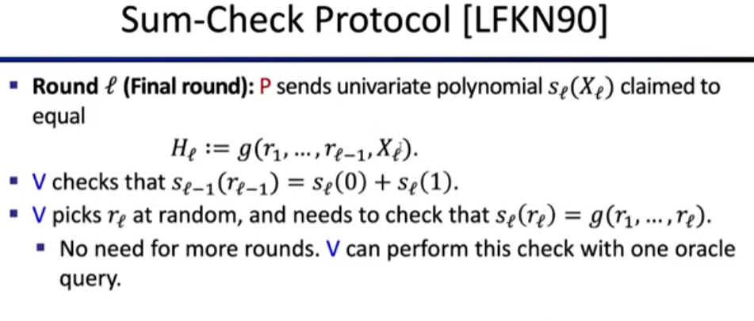

### Analysis of the protocol
Completeness holds by design: If $P$ sends the prescribed messages, then all of $V$'s checks will pass

Soundness:
- If $P$ does not send the prescribed messages, then $V$ rejects with probability at least $1 - \frac{l.d}{|F|}$, where $d$ us the maximum degree of $g$ in any variable.
- E.g. $|F| \approx 2^{128}, d=3, l=60$
  - Then soundness error is at most $3 . 60 / 2^{128} = 2^{-120}$
- Proof is by induction on the number of variables $l$.
  - Base case: $l=1$. In this case, $P$ sens a single message $s_1(X_1)$ claimed to equal $g(X_1)$. $V$ picks $r_1$ at random, checks that $s_1(r_1)=g(r_1)$.
  - If $s_1 \neq g$, then $Pr_{r_1 \in F}[s_1(r_1)=g(r_1)]\leqslant \frac{d}{|F|}$.

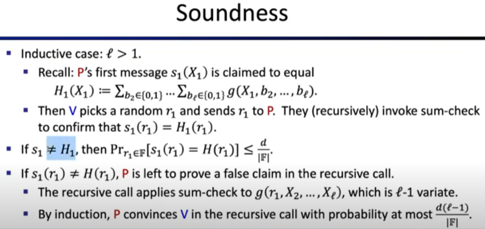

Summary of soundness analysis: if $s_1 \neq H_1$, the probability $V$ accepts is at most:
$$Pr_{r_{1} \in F}[s_1(r_1)=H(r_1)] + Pr_{r_2,...,r_l \in F}[V\ accepts| s_1(r_1)\neq H(r_1)] \leqslant \frac{d}{|F|} + \frac{d(l-1)}{|F|} \leqslant \frac{dl}{|F|}$$

### A first application of the sum-check protocol: An IP for counting triangles with liner-time verifier

- Input: $A \in {0,1}^{n \times n}$, representing the adjacency matrix of a graph
- Desired output: $\sum_{(i,j,k)\in[n]^3}A_{ij}A_{jk}A_{ik}$
- Fastest known algorithm runs in matrix-multiplication time, currently about $n^{2.37}$

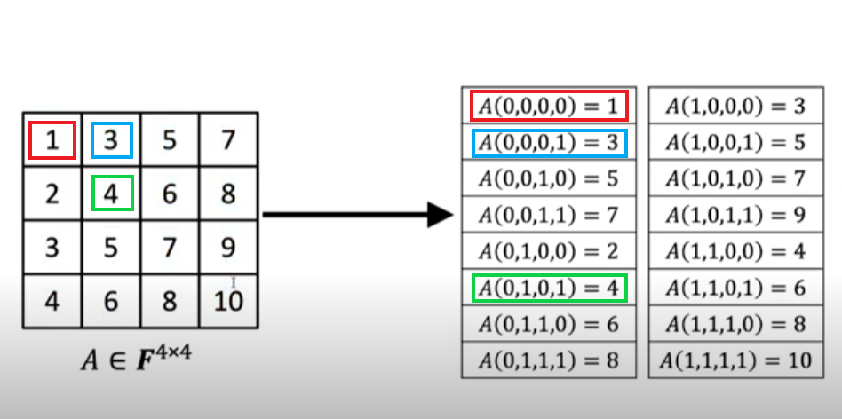
- The protocol:
  - View $A$ as a function mapping ${0,1}^{log(n)} \times {0,1}^{log(n)}$ to $F$.(see picture)
  - As we have seen before, $A$ has a multilinear extension $\widetilde{A}$.
  - Define the polynomial $g(X,Y,Z) = \widetilde{A}(X,Y)\widetilde{A}(Y,Z)\widetilde{A}(X,Z)$. Note $X,Y,Z$ are now bit vectors.
  - Apply the sum-check protocol to $g$ to compute:
  $$ \sum_{(a,b,c)\in \{0,1\}^{3log(n)}} g(a,b,c)$$

- Costs:
  - Total communication is $O(log(n))$, $V$ runtime is $O(n^2)$, $P$ runtime is $O(n^3)$.
  - $V$'s runtime dominated by evaluating:
$$ g(r_1,r_2,r_3) = \widetilde{A}(r_1,r_2)\widetilde{A}(r_2,r_3)\widetilde{A}(r_1,r_3)$$

### A SNARK for circuit-satisfability
#### Recall: SNARKs for circuit-satisfability

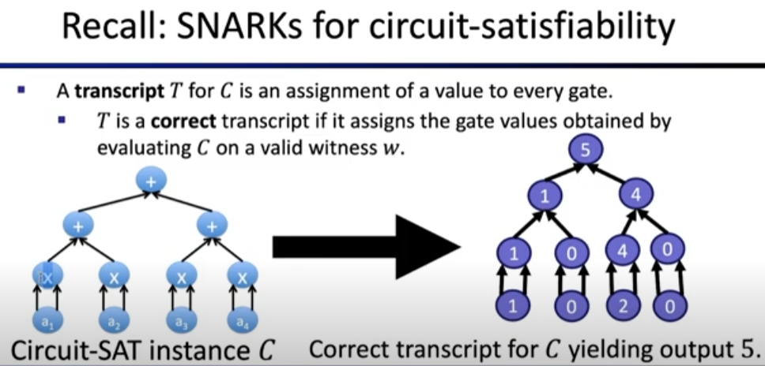

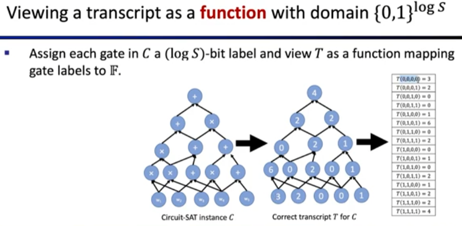

### The polynomial IOP underlying the SNARK
#### The start of the polynomial IOP
- Assign each gate in $C$ a (log S)-bit label and view $T$ as a function mapping gate labels to $F$
- $P$'s first message is a (log S)-variate polynomial $h$ claimed to **extend** a correct transcript $T$, which means:
$$ h(x) = T(x) \forall x \in \{0,1\}^{log(s)}$$
- $V$ needs to check this, but is only able to learn a few evaluations of $h$.

#### Intuition for why $h$ is a useful object for $P$ to send
- Think of $h$ as a **distance-amplified encoding** of the transcript $T$.
- The domain of $T$ is $\{0,1\}^{log(s)}$. The domain of $h$ is $F^{log(s)}$, which is vastly bigger.
- Schwartz-Zippel: if two transcripts $T$, $T'$ disagree at even a **single** gate value, their extension polynomials $h$, $h'$ disagree at **almost all** points in $F^{log(s)}$ !
  - Specifically, a $ 1-log(S) / |F|$ fraction
- Distance-amplifying nature of the encoding will enable $V$ to detect even a single "inconsistency" in the entire transcript.

#### Two-step plan of attack and its application
##### First step: Getting $g_h$ from $h$
We first need to construct a $(3log(s))$-variate polynomial $g_h$ such that $h$ **extends** a correct transcript $T \iff g_h(a,b,c) = 0 \forall (a,b,c) \in \{0,1\}^{3log(s)}$
  - Moreover, to evaluate $g_h(r)$ at any input $r$, it suffices to evaluate $h$ at only 3 inputs.

Proof sketch (simplifcation): Define $g_h(a,b,c) via:
$$\widetilde{add}(a,b,c) . (h(a)-(h(b)+h(c))) + \widetilde{mult}(a,b,c) . (h(a)-h(b).h(c)) \$$
  - 1. $g_h(a,b,c) = h(a)-(h(b)+h(c))$ if $a$ is the label of a gate that computes the **sum** of gates $b$ and $c$
  - 2. $g_h(a,b,c) = h(a)-h(b).h(c)$ if $a$ is the label of a gate that computes the **product** of gates $b$ and $c$
  - 3. $g_h(a,b,c) = 0$ otherwise

##### Second step: Proof that $g_h(a,b,c) = 0$
Then, we need to design an interactive proof to check that $g_h(a,b,c) = 0 \ \forall (a,b,c) \in \{0,1\}^{3log(s)}$
- This design allows $V$ to only need to evaluate $g_h(r)$ at one point $r$.

If $g_h$ was a univariate polynomial $g_h(X)$ and if we needed to check that $g_h$ vanishes over some set $H \subseteq F$ :
  - $g_h(x)=0 \forall x \in H \iff g_h$ is divisible by $Z_H(x)$
    - $Z_H$ is called the vanishing polynomial for $H$
  - Then, polynomial IOP:
    - $P$ sends a polynomial $q$ such that $g_h(X)=q(X).Z_H(X)$
    - $V$ checks this by picking a random $r \in F$ and checking that $g_h(r)=q(r).Z_H(r)$

But it doesn't work because $G_h$ is not univariate. Also, having $P$ find and send the quotient polynomial $q$ is expensive:
  - In the final SNARK, this would mean applying polynomial commitment to additional polynomials
  - This is what Marlin, PlonK and Groth16 do.

The solution is: use the sum-check protocol:
  - handles multivariate polynomials
  - doesn't require $P$ to send additional large polynomials

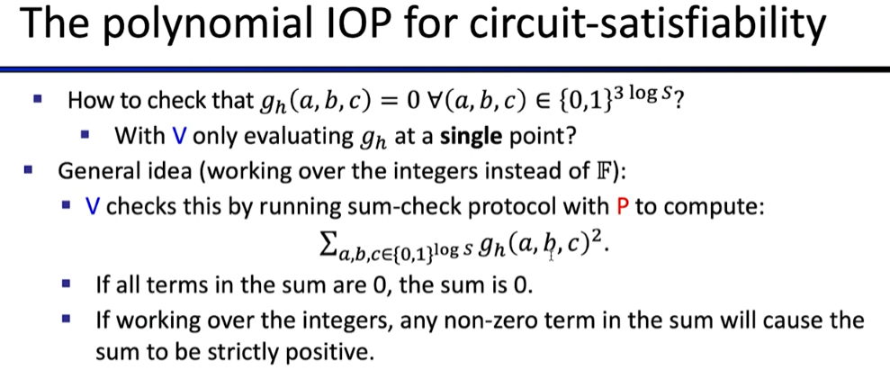
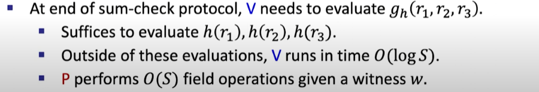

### Recall sum-check protocol
- Goal: compute the quantity:
$$ \sum_{b_1\in\{0,1\}} \sum_{b_2\in\{0,1\}} ... \sum_{b_l\in\{0,1\}} g(b_1,...,b_l)$$
- Proof length is rouughly the total degree of $g$
- Number of rounds is $l$
- $V$ time is roughly the time to evaluate $g$ at a single randomly chosen input.
- To run the protocol $V$ doesn't even need to "know" what polynomial $g$ is being summed, so long as it knows $g(r)$ for a randomly chosen input $r \in F^l$

