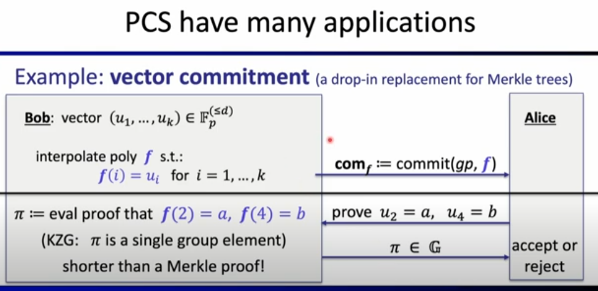
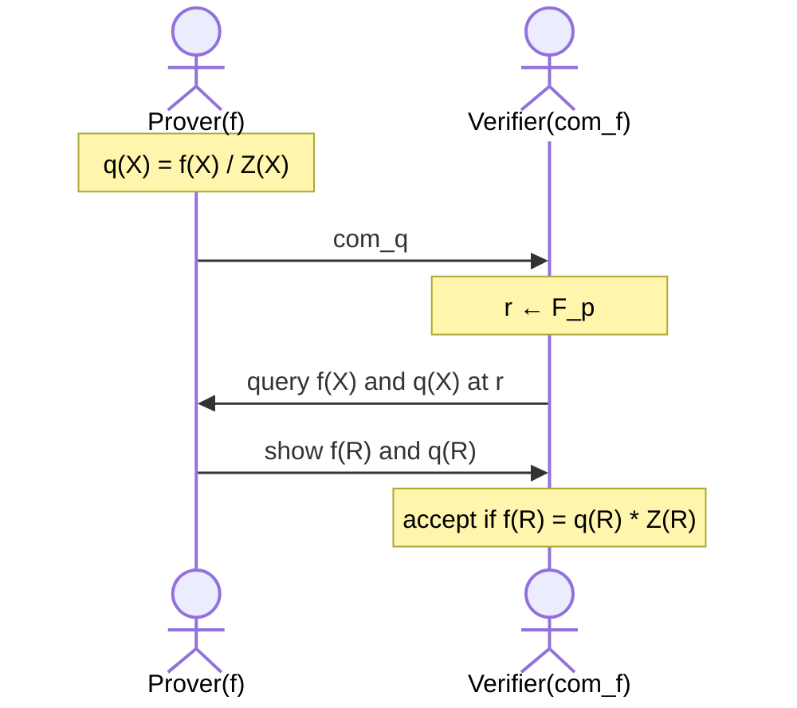
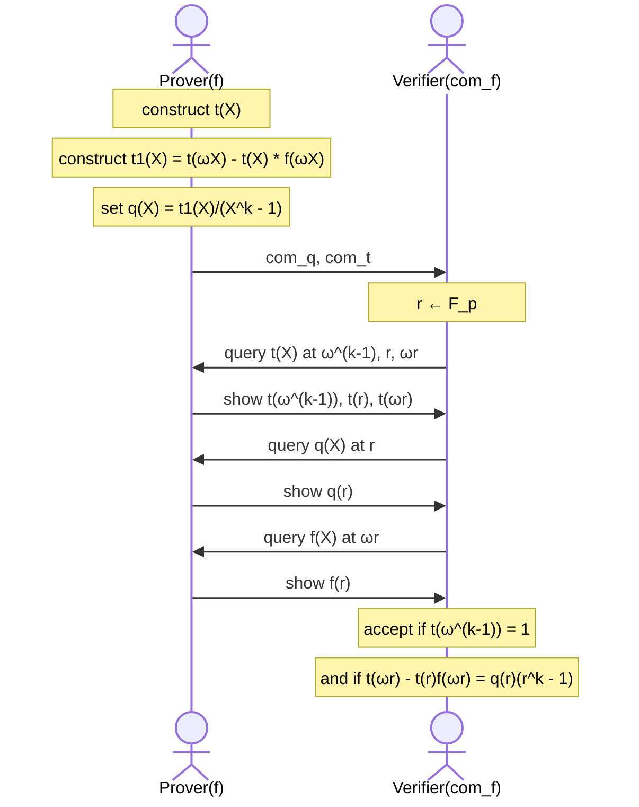
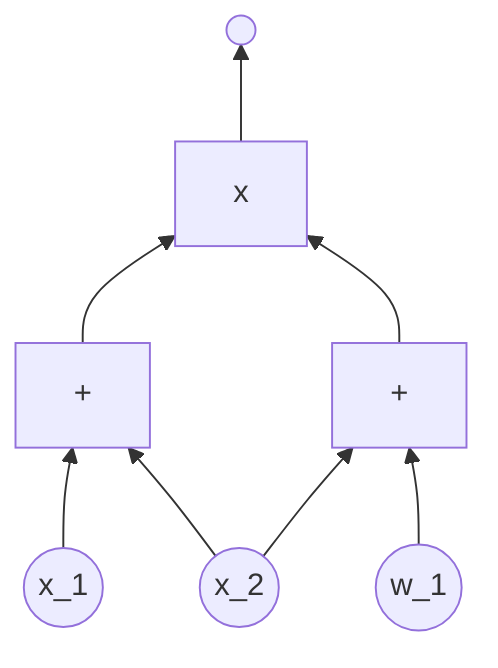
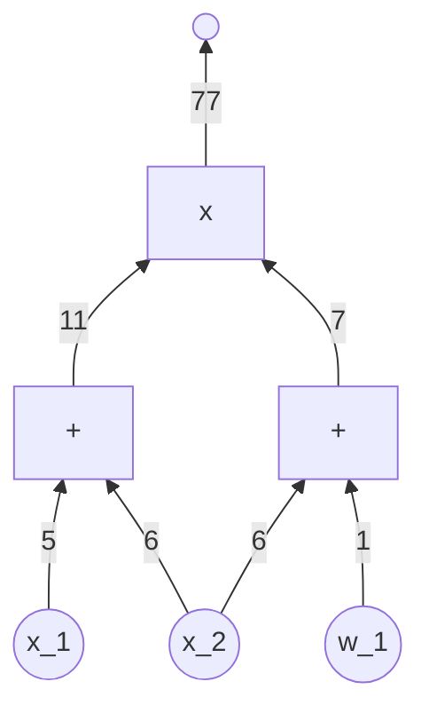
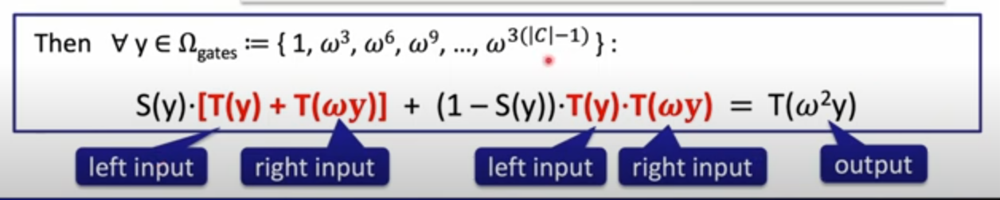
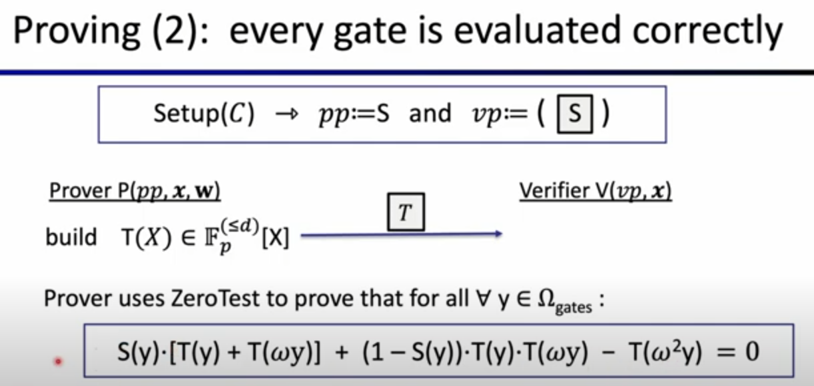
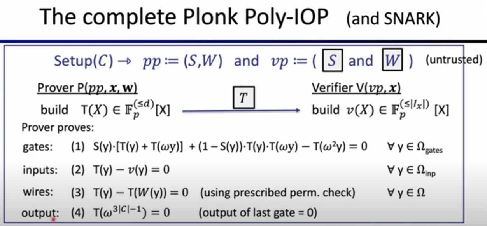

# The PLONK SNARK
Lecturer: Dan Boneh

### Recall: build an efficient SNARK
We take:
- A polynomial commitment scheme
- A polynomial Interactive Oracle Proof (IOP)

Once combined, it gives us the SNARK for general circuits.

#### Review of polynomial commitments
Prover commits to a polynomial $f(X)$ in $\mathbb{F}_p^{(\leqslant d)}[X]$
- eval: for public $u,v \in F_p$, prover can convince the verifier that committed poly satisfies: $f(u)=v$ and $deg(f) \leqslant d$
  - verifier has $(d, com_f, u, v)$
- Eval proof size and verifier time should be $O_{\lambda}(log(d))$

#### Example: KZG poly-commit scheme
KZG poly-commit scheme is a very widely used scheme.
- First, it uses a group $G = \{0, G, 2.G, 3.G, ..., (p-1).G\}$ of order $p$.
- $setup(\lambda) \rightarrow gp$ :
  - Sample random $\tau \in F_p$
  - $gp = (H_0 = G, H_1=\tau . G, H_2=\tau^2 . G, ..., H_d = \tau^d . G) \in \mathbb{G}^{d+1}$
  - delete $\tau$ !!! This to get a trusted setup. If it leaks, then one can break the commitment scheme, one can produce incorrect evaluations proofs.
- $commit(gp, f) \rightarrow com_f$ where $com_f := f(\tau).G \in \mathbb{G}$
  - $f(X) = f_0 + f_1X + ... + f_d X^d \Rightarrow com_f = f_0 . H_0 + ... + f_d . H_d$
    - $com_f = f_0 . G + f_1\tau.G + f_2\tau^2 . G + ... = f(\tau) . G$

Note: it is a binding commitment, not a hiding one

- Eval: Goal is to prove that $f(u) = v$
  - $Prover(gp, f, u, v)$
  - $Verifier(gp, com_f, u, v)$
  - $f(u) = v \Leftrightarrow u$ is a root of $\widehat{f} := f-v \Leftrightarrow (X-u)$ divides $\widehat{f}$
    - exists $q \in \mathbb{F}_p[X]$ such that $q(X).(X-u)=f(X)-v$
  - The prover will compute $q(X)$ and $com_q$ and so proof $\pi := com_q \in \mathbb{G}$
    - Here we can see that proof size is independent of degree $d$
  - Verifier accepts if : $(\tau-u).com_q = com_f -v . G$
    - Verifier does not know $\tau \Rightarrow$ uses a "pairing" (and only needs $H_0, H_1$ from $gp$)

**Generalizations:**
- Can also use KZG to k-variate polynomials
- Batch proofs:
  - suppose verifier has commitments $com_{f1}, ..., com_{fn}$
  - prover wants to prove $f_i(u_i, j) = v_{i,j}$ for $i \in [n], j \in [m]$
  - $\Rightarrow$ batch proof $\pi$ is only one group element !

**Properties of KZG: linear time commitment**

Two ways to represent a polynomial $f(X)$ in $\mathbb{F}_p^{(\leqslant d)}[X]$ :
- **Coefficient representation**: $f(X) = f_0 + f_1X + ... + f_d X^d$
  - $\Rightarrow$ computing $com_f = f_0.H_0 + ... + f_d.H_d$ takes linear time in $d$
- **Point value representation**: $(a_0, f(a_0)), ..., (a_d, f(a_d))$
  - computing $com_f$ naively: construct coefficients (f_0, f_1, ..., f_d)
    - $\Rightarrow$ time $O(d . log(d))$ using Number Theory Transform (NTT)
  - a better way to compute $com_f$
    - With Lagrange interpolation: $f(\tau) = \sum_{i=0}^d \lambda_i(\tau).f(a_i)$
    - **Idea**: transform $gp$ into Lagrange form
      - $\widehat{gp} = (\hat{H}_0 = \lambda_0(\tau)G, \hat{H}_1=\lambda_1(\tau) . G, \hat{H}_2=\lambda_2(\tau) . G, ..., \hat{H}_d = \lambda_d(\tau) . G) \in \mathbb{G}^{d+1}$
    - Now, $com_f = f(\tau) . G = f(a_0) . \hat{H}_0 + ... + f(a_d).\hat{H}_d$
      - $\Rightarrow$ linear time in d (better than $O(d.log(d))$)

**KZG fast multi-point proof generation**

Prover has some $f(X)$ in $\mathbb{F}_p^{(\leqslant d)}[X]$. Let $\Omega \subseteq \mathbb{F}_p$ and $|\Omega|=d$
  - Suppose prover needs evaluation proofs $\pi_a \in G$ for all $a \in \Omega$
    - Naively, takes time $O(d^2)$: $d$ proofs each takes time $O(d)$
    - Feist-Khovratovich (FK) algorithm (2020):
      - if $\Omega$ is a multiplicative subgroup: time $O(d.log(d))$
      - otherwise: time $O(d.log^2(d))$

**The difficulties with KZG:**
- trusted setup for $gp$
- and $gp$ size is linear in $d$

#### Dory polynomial commitment
- transparent setup: no secret randomness in setup (corresponds to the $\tau$ for KZG)
- $com_f$ is a single group element
- eval proof size for $f \in \mathbb{F}_p^{(\leqslant d)}[X]$ is $O(log(d))$ group elements
- eval verify time is $O(log(d))$
- Prover time: $O(d)$

#### Polynomial Commitment Scheme have many applications
Example: **vector commitment** (a drop-in replacement for Merke trees)

 ## Proving properties of committed polynomials
 ### Polynomial equality testing with KZG
 For KZG:
 - $f=g$ $\Leftrightarrow$ $com_f = comf_g$
 - So, verifier can tell on its own if $f=g$

 But, the prover is needed if the are some equality test of computed polynomials:
 - Example: $verifier$ has commitments to $f$, $g_1$, $g_2$ and $g_3$
   - Then, to test if $f = g_1g_2g_3$: V queries all four polynomials at random $r$ and tests equality
  - This is complete and sound assuming $3d / p$ is negligible ($deg(g_1g_2g_3) \leqslant 3d$)

### Important Proof Gadgets for Uni-variates
Copied from https://crypto-notes-erhant.vercel.app/zklearning___5-the-PLONK-snark.md

Let $\Omega \subseteq \mathbb{F}_p$ where $|\Omega|=k$. Let $f \in \mathbb{F}_p^{(\leq d)}[X]$ be a polynomial of degree $d$ and $d \geq k$. The verifier has a commitment to this polynomial, $\boxed{f}$.

We will now construct efficient poly-IOPs for the following proof gadgets:

- **Equality Test**: prove that $f, g$ are equal. We know that evaluating them at a random point and seeing if they are equal does the trick, assuming degree is much smaller than the size of the finite field.
- **Zero Test**: prove that $f$ is identically zero on $\Omega$, meaning that it acts like a zero-polynomial for every value in $\Omega$, but of course it can do whatever it wants for values outside of $\Omega$ but in $\mathbb{F}_p$.
- **Sum Check**: prove that $\sum_{a\in \Omega}f(a) = 0$
- **Product Check**: prove that $\prod_{a\in \Omega} f(a) = 1$
- **Permutation Check**: prove that evaluations of $f$ over $\Omega$ is a permutation of evaluations of $g$ over $\Omega$
- **Prescribed Permutation Check**: prove that evaluations of $f$ over $\Omega$ is a permutation of evaluations of $g$ over $\Omega$, with a “prescribed” permutation $W : \Omega \to \Omega$. This permutation is a bijection $\forall i \in [k] : W(\omega^i) = \omega^j$

To start, we need to introduce the concept of a **vanishing polynomial**.

**Definition**: The vanishing polynomial of $\Omega$ (as defined above) is:

$$
Z_\Omega(X) := \prod_{a\in\Omega}(X-a)
$$

with degree $k$. Then, let $\omega \in \mathbb{F}_p$ be a primitive $k$-th root of unity, meaning that $\omega^k = 1$. If the set $\Omega$ is defined as follows:

$$
\Omega = \{1, \omega, \omega^2, \ldots, \omega^{k-1}\} \subseteq \mathbb{F}_p
$$

then $Z_\Omega(X) = X^k-1$. This is really nice, because for such cases, evaluating $Z_\Omega(r)$ for some random field element $r$ means just taking $r^k$ and subtracting one, which costs around $\log k$ field operations, thanks to repeated-squaring method of multiplication.

### Zero Test

In the following graph, we denote `Z(r)` for $Z_\Omega(r)$. Also remember that when we say “the verifier queries some polynomial and the prover shows its evaluation”, what we mean is that in the background the prover computes them and sends the result along with an evaluation proof.

With that said, let us see the zero-test poly-IOP.

Let’s analyze the costs in this IOP:

- The verifier made two polynomial queries (although a batch proof could have been done), and also it computed $Z_\Omega(r)$ on it’s own which takes time $\mathcal{O}(\log k)$.
- The prover time is dominated by the time to compute $q(X)$ and then commit to it, which runs in time $\mathcal{O}(k \log k)$.

### Product Check and Sum Check

Prod-check and sum-check are almost identical, so we will only look at prod-check. Again, our claim is that $\prod_{a \in \Omega}f(a)=1$ and we would like to prove that.

Set $t \in \mathbb{F}_p^{(\leq k)}[X]$ to be a polynomial of degree $k$. Define the evaluations of this polynomial as follows:

- $t(1) = f(1)$
- $t(\omega)= f(1) \times f(\omega)$
- $t(\omega^2) = f(1) \times f(\omega) \times f(\omega^2)$
- and so on, with the final evaluation of $t(\omega^{k-1})$ being equal to the product itself!
- $t(\omega^{k-1}) = \prod_{a \in \Omega} f(a)=1$

You can see that we can define $t(\omega^s) = \prod_{i = 0}^{s}f(\omega^i)$ for $s \in [k-1]$. It is also important to notice the recurrence relation between $t$ and $f$:

$$
\forall x \in \Omega : t(\omega x) = t(x) f(\omega x)
$$

which is made possible because $\Omega$ consists of powers of $\omega$. The lemma we will use with these is the following:

- if $t(\omega^{k-1}) = 1$
- and $t(\omega x) - t(x) f(\omega x) = 0$ for all $x \in \Omega$
- then, $\prod_{a \in \Omega}f(a) = 1$

Let’s write the interactive proof! The idea will to construct another polynomial $t_1(X)$ which is:

$$
t_1(X) = t(\omega X) - t(x)f(\omega X)
$$

which implies that if a zero-test on $t_1(X)$ for $\Omega$ passes, then prod-check passes.

The cost of this protocol is as follows:

- Proof size is two commitments ($\boxed{q}, \boxed{t}$) and five evaluations, and keeping in mind that evaluations can be batched, the entire proof size is just 3 group elements.
- Prover time is dominated by computing $q(X)$ that runs in time $\mathcal{O}(k \log k)$
- Verifier time is dominated by computing $(r^k-1)$ and $\omega^{k-1}$, both in time $\mathcal{O}(\log k)$

Note that almost the same protocol works for **rational functions**. There, our claim is $\prod_{a\in \Omega}(f/g)(a)=1$ and we construct a similar $t$ polynomial, only this time $f(x)$ is divided by $g(x)$ in the definition. Then, the lemma is also similar:

- if $t(\omega^{k-1}) = 1$
- and $t(\omega x)g(wx) - t(x) f(\omega x) = 0$ for all $x \in \Omega$
- then, $\prod_{a \in \Omega}f(a)/g(a) = 1$

Almost the same!

### Permutation Check

We have two polynomials $f, g \in \mathbb{F}_p^{(\leq d)}[X]$ and we want to show that

- $(f(1), f(\omega), f(\omega^2), \ldots, f(\omega^{k-1})) \in \mathbb{F}_p^k$ is just a permutation of
- $(g(1), g(\omega), g(\omega^2), \ldots, g(\omega^{k-1})) \in \mathbb{F}_p^k$
- essentially proving that $g(\Omega)$ is same as $f(\Omega)$, but just permuted.

To prove this, we will do what is known as the Lipton’s trick [Lipton’89]. We will construct two auxiliary polynomials:

- $\hat{f}(X) = \prod_{a \in \Omega}(X - f(a))$
- $\hat{g}(X) = \prod_{a \in \Omega}(X - g(a))$

Now notice that $\hat{f} = \hat{g}$ if and only if $f$ is a permutation of $g$. This is because the product is a series of multiplications, which is a commutative operation.

Normally, to prove that $\hat{f} = \hat{g}$ the prover would only have to show the evaluation of them at a random point, $r \in \mathbb{F}_p$ given by the verifier. However, computing these polynomials are a bit expensive, so instead the prover will do a clever trick: do a prod-check on the following rational function:

$$
\frac{\hat{f}(r)}{\hat{g}(r)} = \prod_{a \in \Omega}\left(\frac{r - f(a)}{r - g(a)}\right) = 1
$$

We have just mentioned that prod-check can be done on rational functions, so we can very well do this! The cost of this proof is just two commitments, and six evaluations.

### Prescribed Permutation Check

Again we have two polynomials $f, g \in \mathbb{F}_p^{(\leq d)}[X]$ and a permutation $W: \Omega \to \Omega$. The verifier has commitments to these $\boxed{f}, \boxed{g}, \boxed{W}$. Our claim is that $f(y) = g(W(y))$ for all $y \in \Omega$, in other words, $g$ is a permutation of $f$ over $\Omega$ as described by $W$.

At a first glance, it is tempting to do a simple **zero-test** on $f(y) -  g(W(y))=0$, right? Nope, notice that $g(W(y))$ results in a polynomial of degree $|\Omega|^2$, but we wanted to have a linear time prover; this results in a quadratic time prover!

Instead, we have a clever method that will run in linear time. We start with the following observation: if the set of pairs $(W(a), f(a))_{a \in \Omega}$ is a permutation of $(a, g(a))_{a \in \Omega}$ then $f(y) = g(W(y))$ for all $y \in \Omega$.

Here is a quick example of this:

- Permutation: $W(\omega^0) = \omega^2, W(\omega^1) = \omega^0, W(\omega^2) = \omega^1$
- First set of pairs: $(\omega^0, g(\omega^0)), (\omega^1, g(\omega^1)), (\omega^2, g(\omega^2))$
- Second set of pairs: $(\omega^0, f(\omega^0)), (\omega^2, f(\omega^1)), (\omega^1, f(\omega^2))$

For the proof itself, we actually need bivariate polynomials; univariate polynomials will not be enough. Nevertheless, the proof is much similar to the previously described permutation check.

Define two auxiliary polynomials, which will be bivariate polynomials of total degree $|\Omega|$:

- $\hat{f}(X, Y) = \prod_{a \in \Omega}(X - Y \cdot W(a) - f(a))$
- $\hat{g}(X, Y) = \prod_{a \in \Omega}(X - Y \cdot a - g(a))$

The lemma here is that if $\hat{f}(X, y) = \hat{g}(X, Y)$ then $(W(a), f(a))_{a \in \Omega}$ is a permutation of $(a, g(a))_{a \in \Omega}$. The proof of this is left as exercise, though if you want to try, you might make use of the fact that $\mathbb{F}_p[X, Y]$ is a unique factorization domain.

The protocol continues with the verifier generating two random points $r, s \in \mathbb{F}_p$ and sending these to the prover. Again, instead of actually evaluating the auxiliary polynomials, the prover will do a prod-check over what they describe:

$$
\frac{\hat{f}(r, s)}{\hat{g}(r, s)} = \prod_{a \in \Omega}\left(\frac{r - s\cdot W(a) - f(a)}{r - s \cdot a - g(a)}\right) = 1
$$

This protocol is sound and complete, assuming $2d/p$ is negligible. The cost of this protocol is just like the cost described for prod-check.

## The PLONK IOP for for general circuits

### Real-world SNARK
Plonk IOP + KZG (need of pairings) = Aztec, Jellyfish
Plonk IOP + Bulletproofs (no need of pairings) = Halo2 (slow verifier, no trusted setup)
Plonk IOP + FRI (based on hashing) = Plonky2 (no trusted setup)

### PLONK: a poly-IOP for a general circuit $C(x,w)$
Example for a circuit that calculates $(x_1 + x_2)(x_2 + w_1)$

We will take $x_1=5, x_2=6, w_1=1$ as example. Then, the circuit looks like this:

#### Step 1: Compile circuit to a computation trace:
  - Circuit inputs are 5, 6 and 1 (witness).
  - R1CS gates shoud look like :

| Input | Input | Output |
|---|---|---|
| 5 | 6 | 11|
| 6 | 1 | 7 |
| 11 | 7 | 77 |

Then, we encode the trace as a polynomial. First some notation :
- $|C|$ is the total number of gates
- $|I| = |I_x| + |I_w|$ is the number of inputs to C (here 5, 6 and 1)
- $d = 3|C| + |I|$ and $\Omega = \{1, \omega, \omega^2, ..., \omega^{d-1}\}$
  - In our example, $d=12$

The plan is to interpolate a polynomial $T \in \mathbb{F}_p^{(\leqslant d)}[X]$ that encodes the entire trace:
- (1) $T$ encodes all inputs: $T(\omega^{-j})$ = input #j, for $j$ = 1, ..., |I|
  - In our case, $T(\omega^{-1}) = 5$, $T(\omega^{-2}) =6$ and $T(\omega^{-3}) = 1$
- (2) $T$ encodes all wires: $\forall l = 0, ..., |C| - 1$:
  - $T(\omega^{3l})$: left input to gate #l
  - $T(\omega^{3l+1})$: right input to gate #l
  - $T(\omega^{3l+2})$: output of gate #l

Once applied to our example, prover interpolates T(X) such that:
| Inputs | $T(\omega^{-1}) = 5$ | $T(\omega^{-2}) = 6$ | $T(\omega^{-3}) = 1$ |
|---|---|---|---|
| Gate 0 | $T(\omega^{0}) = 5$ | $T(\omega^{1}) = 6$ | $T(\omega^{2}) = 11$|
| Gate 1 | $T(\omega^{3}) = 6$ | $T(\omega^{4}) = 1$ | $T(\omega^{5}) = 7$ |
| Gate 2 | $T(\omega^{6}) = 11$ | $T(\omega^{7}) = 7$ | $T(\omega^{8}) = 77$ |

Note: Here, degree(T) = 11.

Prover can use FFT to compute the coefficients of $T$ in time $O(d log(d))$. But, the point value representation is commonly used.

#### Step 2: proving validity of T
Prover needs to prove that $T$ is a correct computation trace:
- (1) T encode the correct inputs
- (2) every gate is evaluated correctly
- (3) the wiring is implemented correctly
- (4) the output of last gate is 0

Note: Proving (4) is easy: prove $T(\omega^{3|C|-1}) = 0$

- Proving (1): 
  - Both prover and verifier interpolate a polynomial $v(X) \in \mathbb{F}_p^{\leqslant |I_x|}[X]$ that encode the $x$-inputs to the circuits: for $j=1,...,|I_x| : v(\omega{-j})$ = input(#j)
    - In our example: $v(\omega^{-1}) = 5, v(\omega^{-1}) = 6$ (v is linear)
  - Prover proves (1) by using a ZeroTest on $\Omega_{inp}$ to prove that:
    - $T(y) - v(y) = 0, \forall y \in \Omega_{inp}$

  
- Proving (2): every gate is evaluated correctly
  - Idea: encode gate types using a selector polynomial S(X)
    - define $S(X) \in \mathbb{F}_p^{(\leqslant d)}[X]$ such that $\forall l = 0,...,|C| - 1$
      - $S(\omega^{3l}) = 1$ if gate $#l# is an addition gate
      - $S(\omega^{3l}) = 0$ if gate $#l# is a multiplication gate

| Inputs | $T(\omega^{-1}) = 5$ | $T(\omega^{-2}) = 6$ | $T(\omega^{-3}) = 1$ | $S(X)$ |
|---|---|---|---|---|
| Gate 0 | $T(\omega^{0}) = 5$ | $T(\omega^{1}) = 6$ | $T(\omega^{2}) = 11$| 1 |
| Gate 1 | $T(\omega^{3}) = 6$ | $T(\omega^{4}) = 1$ | $T(\omega^{5}) = 7$ | 1 |
| Gate 2 | $T(\omega^{6}) = 11$ | $T(\omega^{7}) = 7$ | $T(\omega^{8}) = 77$ | 0 |

- Proving (3)

We need to encode the wires of C,to do this, we want to make sure that (using our example):
  - $T(\omega^{-2}) = T(\omega^{1}) = T(\omega^{3})$
  - $T(\omega^{-1}) = T(\omega^{0})$
  - $T(\omega^{2}) = T(\omega^{6})$
  - $T(\omega^{-3}) = T(\omega^{4})$

To do this, we define a polynomial $W : \Omega \rightarrow \Omega$ that implements a rotation:
  - $W(\omega^{-2},\omega^{1},\omega^{3}) = (\omega^{1},\omega^{3}, \omega^{-2})$
  - $\forall y \in \Omega: T(y) = T(W(y)) \Rightarrow$ wire constraints are check

#### The complete Plonk Poly-IOP (and SNARK)

Theorem: Plonk Poly-IOP is complete and knowledge sound assuming $7|C|/p$ is negligible

## Quiz
|Question | Answers|
|---|---|
|KZG prover must not know tau to preserve soundness of the polynomial commitment scheme	| true |
|The complexity of KZG verifier is independent of polynomial degree d	| true |
|KZG commitment scheme can't be used to commit to rational functions	| true |
|A KZG setup for committing polynomials in the coefficient representation can't be repurposed to commit polynomials in the point-value represention	| false |
|Unlike vector commitments, polynomial commitments support batch evaluation proofs	| false |
|In ZeroTest, the degree bound on quotient polynomial q(X) ensures that it is not a rational function	| true |
|ProductCheck protocol incurs quasilinear prover complexity because the polynomial t(X) is defined in the point-value representation	| true |
|The set Omega is required to be a multiplicative subgroup in the ProductCheck protocol	| true |
|The claim that sets F = ${f(a)}_{a \in \Omega} and G = {g(a)}_{a \in \Omega}$ are permutations of each other can be reduced to the following product-check claim: \prod_{a \in \Omega} f(a)/g(a) = 1	| false |
|Unlike the sumcheck-based polynomial IOP discussed in lecture 4, the plonk IOP has verifier complexity independent of circuit size	| false |
|Unlike the sumcheck-based polynomial IOP discussed in lecture 4, the plonk IOP has constant number of rounds	| true |
|The custom gates beyond addition and multiplication in plonkish arithmetization help reduce prover time| true |