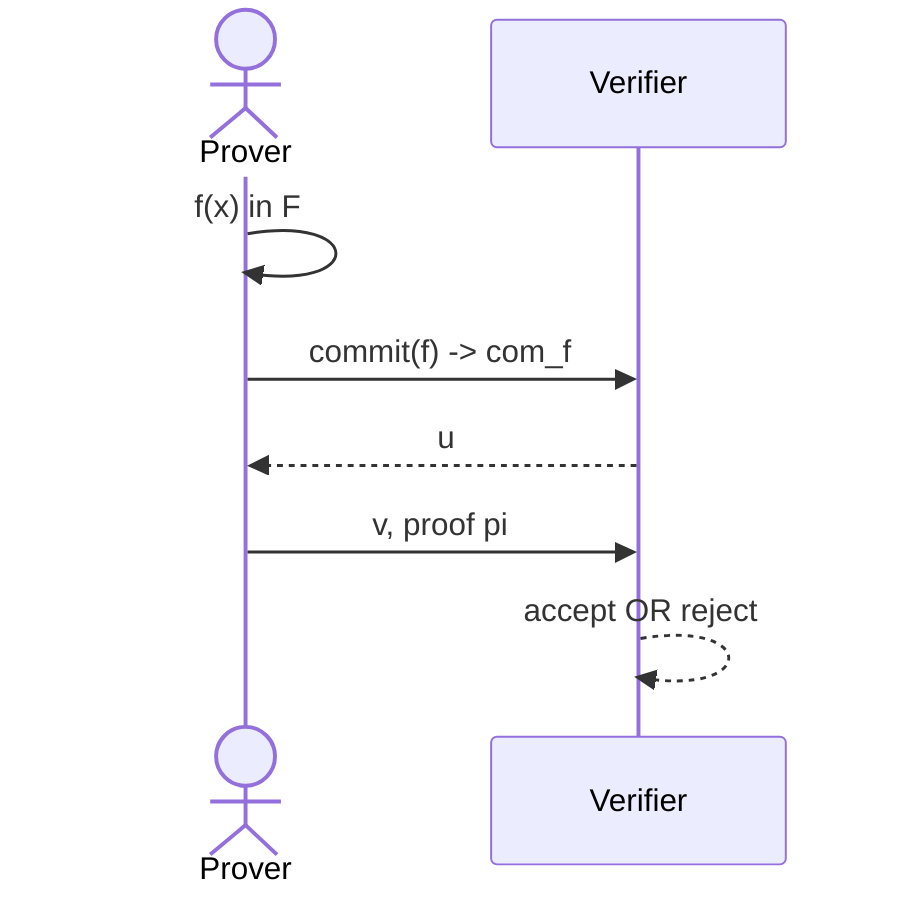

# Polynomial Commitments based on Pairing and Discrete Logarithm
Lecturer: Yupeng Zhang

## Recall
### An efficient SNARK
Polynomial Commitment scheme + Polynomial Interactive Oracle Proof (IOP) $\Rightarrow$ SNARK for general circuits

## Plonk
Univariate Polynomial Commitment + Plonk Polynomial IOP $\Rightarrow$ SNARK for general circuits

### Interactive proofs
Multivariate polynomial commitment + Sumcheck protocol $\Rightarrow$ SNARK for general circuits

### What is a polynomial commitment
First, we need to choose a family of polynomials $\mathbb{F}$

With pi a proof that $f(u) = v$ and $f \in \mathbb{F}$.

### Definitions of polynomial commitments
- $keygen(\lambda, \mathbb{F}) \rightarrow gp$
- $commit(gp, f) \rightarrow com_f$
- $eval(gp, f, u) \rightarrow v, \pi$
- $verify(gp, com_f, u, v, \pi) \rightarrow accept\ OR\ reject$

**Knowledge sound**: for every poly time adversary $A=(A_0,A_1) such that $keygen(\lambda, \mathbb{F}) \rightarrow gp$, $A_0(gp) \rightarrow com_f$, $A_1(gp, u) \rightarrow v, \pi$ :  $Pr[V(vp, x, \pi) = accept] = 1$

so, there is an efficient **extractor** $E$ (that uses $A$) such that:
- $keygen(\lambda, \mathbb{F}) \rightarrow gp$, $A_0(gp) \rightarrow com_f$, $E(gp, com_f) \rightarrow f$ : $Pr[f(u)=v and f(x) \in \mathbb{F}] > 1 - \epsilon$ (for a negligible $\epsilon$)

### Plan of this lecture
- Background
- KZG polynomial commitment and its variants
- Bulletproofs and other schemes based on discrete-log

## Background
### Group
A set $\mathbb{G}$ and an operation $*$ :
- Closure: For all $a,b \in \mathbb{G}, a*b \in \mathbb{G}$
- Associtativity: For all $a,b,c \in \mathbb{G}, (a*b) * c = a * (b * c)$
- Identity: There exists a unique element $e \in \mathbb{G}$ such that for every $a \in \mathbb{G}, e*a = a*e = a$
- Inverse: For each $a \in \mathbb{G}$, there $b \in \mathbb{G}$ such that $a*b = b*a = e$

Example: 
- positive integers mod prime p: {1,2,...,p-1} under multiplication

### Generator of a group
- An element $g$ that generates all elements in the group by taking all powers of $g$
    - Example: $\mathbb{Z}_7^* = \{1,2,3,4,5,6\}$
    - $3^1 = 3$ ; $3^2 = 2$ ; $3^3 = 6$ ; $3^4 = 3$ ; $3^5 = 5$ ; $3^6 = 1$ (all calculations modulo 7)
    - $3$ is here a generator in this example

### Discrete logarithm assumption
- A group $\mathbb{G}$ has an alternative representation as the powers of the generator $g: \{g, g^2, g^3, ..., g^{p-1}\}$
- **Discrete logarithm problem**:
    - given $y \in \mathbb{G}$, find $x$ such that $g^x = y$
- Example: Find $x$ such that $3^x = 4 mod 7$
- **Discrete logarithm assumption**: discrete-log problem is computationally hard

Note: Quantum computers will be able to solve this discrete-log problem on polynomial time $\Rightarrow$ This will no longer be secure

### Diffie-Hellman assumption
- Computational DH assumption:
    - Given $\mathbb{G}, g, g^x, g^y$, cannot compute $g^{xy}$

### Bilinear pairing
- $(p, \mathbb{G}, g, \mathbb{G}_T, e)$
    - $\mathbb{G}$ and $\mathbb{G}_T$ are both multiplicative cyclic group of order $p$. $g$ is the generator of $\mathbb{G}$
    - $\mathbb{G}$: base group, $\mathbb{G}_T$: target group
- Pairing: $e(P^x,Q^y) = e(P,Q)^{xy} : \mathbb{G} \times \mathbb{G} \rightarrow \mathbb{G}_T$
- Example: $e(g^x, g^y) = e(g,g)^{xy} = e(g^{xy}, g)
    - Given $g^x$ and $g^y$, a pairing can **check** that some element $h = g^{xy}$ without knowing $x$ and $y$

### Example: BLS signature
- $Keygen:\ p, \mathbb{G}, g, \mathbb{G}_T, e$
    - private key $x$, public key $g^x$

- $Sign(sk, m):\ H(m)^x \rightarrow \sigma$, where $H$ is a cryptographic hash that maps the message space to $\mathbb{G}$

- $Verify(\sigma, m):\ e(H(m), g^x) = e(\sigma, g)$
    - and so we have : $e(H(m), g^x) = e(H(m)^x,g)$ as $\sigma = H(m)^x$

