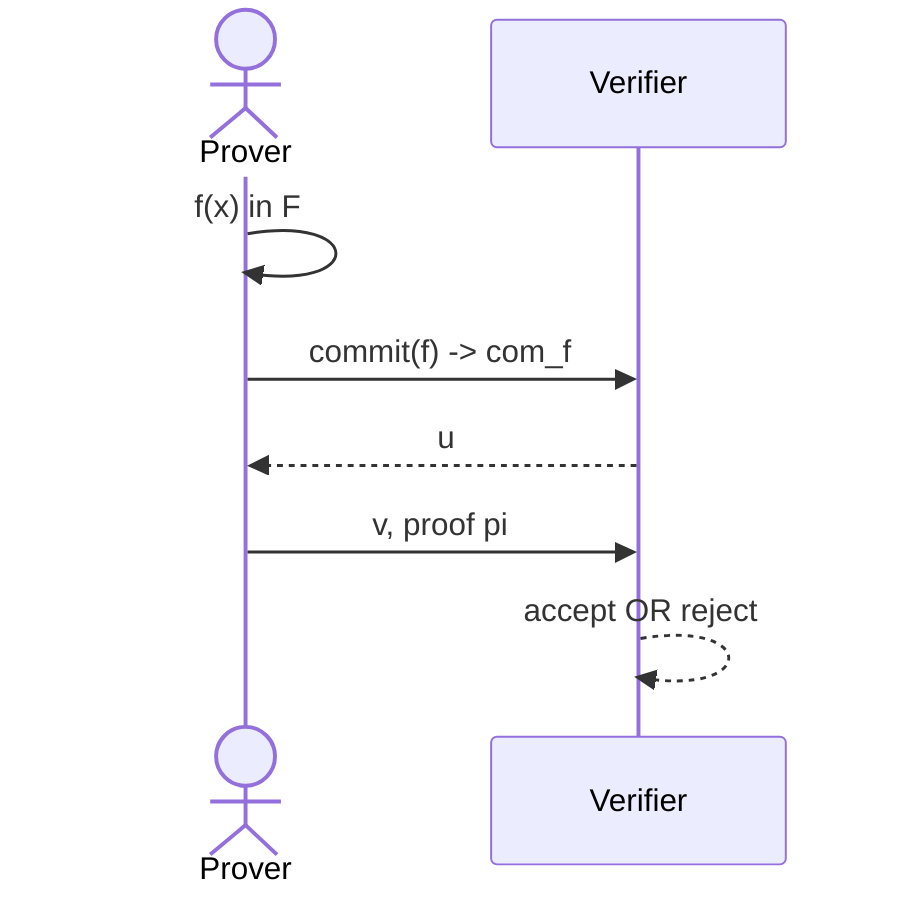
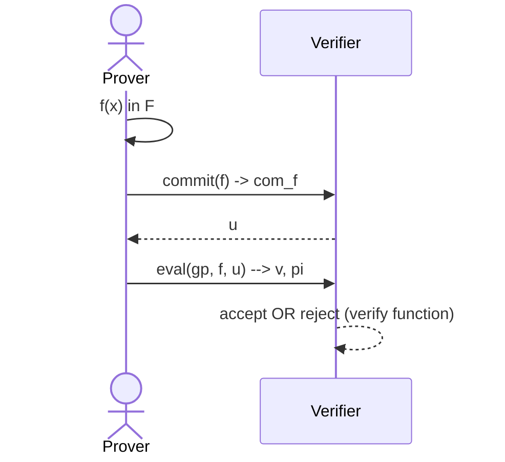
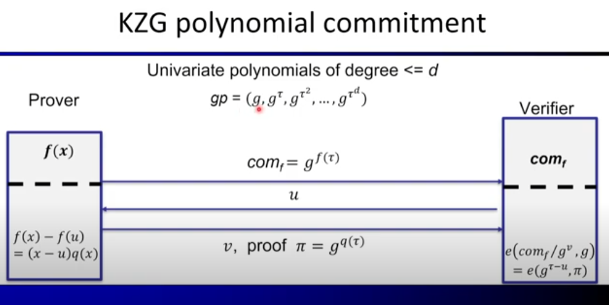
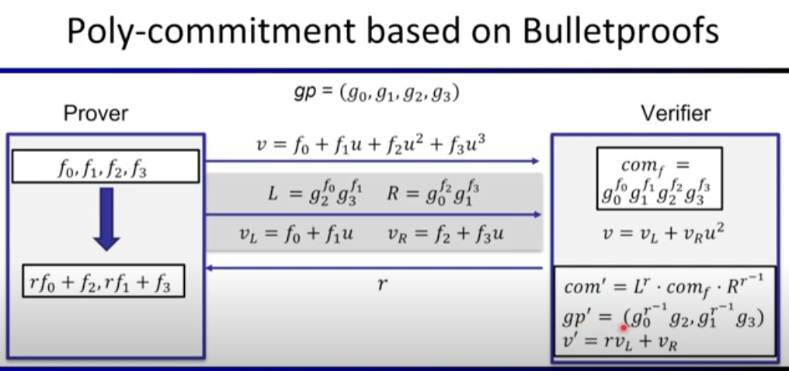
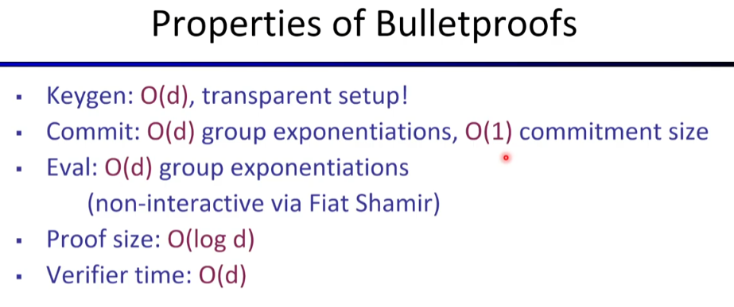

# Polynomial Commitments based on Pairing and Discrete Logarithm
Lecturer: Yupeng Zhang

## Recall
### An efficient SNARK
Polynomial Commitment scheme + Polynomial Interactive Oracle Proof (IOP) $\Rightarrow$ SNARK for general circuits

## Plonk
Univariate Polynomial Commitment + Plonk Polynomial IOP $\Rightarrow$ SNARK for general circuits

### Interactive proofs
Multivariate polynomial commitment + Sumcheck protocol $\Rightarrow$ SNARK for general circuits

### What is a polynomial commitment
First, we need to choose a family of polynomials $\mathbb{F}$

With pi a proof that $f(u) = v$ and $f \in \mathbb{F}$.

### Definitions of polynomial commitments
- $keygen(\lambda, \mathbb{F}) \rightarrow gp$
- $commit(gp, f) \rightarrow com_f$
- $eval(gp, f, u) \rightarrow v, \pi$
- $verify(gp, com_f, u, v, \pi) \rightarrow accept\ OR\ reject$

**Knowledge sound**: for every poly time adversary $A=(A_0,A_1) such that $keygen(\lambda, \mathbb{F}) \rightarrow gp$, $A_0(gp) \rightarrow com_f$, $A_1(gp, u) \rightarrow v, \pi$ :  $Pr[V(vp, x, \pi) = accept] = 1$

so, there is an efficient **extractor** $E$ (that uses $A$) such that:
- $keygen(\lambda, \mathbb{F}) \rightarrow gp$, $A_0(gp) \rightarrow com_f$, $E(gp, com_f) \rightarrow f$ : $Pr[f(u)=v and f(x) \in \mathbb{F}] > 1 - \epsilon$ (for a negligible $\epsilon$)

### Plan of this lecture
- Background
- KZG polynomial commitment and its variants
- Bulletproofs and other schemes based on discrete-log

## Background
### Group
A set $\mathbb{G}$ and an operation $*$ :
- Closure: For all $a,b \in \mathbb{G}, a*b \in \mathbb{G}$
- Associtativity: For all $a,b,c \in \mathbb{G}, (a*b) * c = a * (b * c)$
- Identity: There exists a unique element $e \in \mathbb{G}$ such that for every $a \in \mathbb{G}, e*a = a*e = a$
- Inverse: For each $a \in \mathbb{G}$, there $b \in \mathbb{G}$ such that $a*b = b*a = e$

Example: 
- positive integers mod prime p: {1,2,...,p-1} under multiplication

### Generator of a group
- An element $g$ that generates all elements in the group by taking all powers of $g$
    - Example: $\mathbb{Z}_7^* = \{1,2,3,4,5,6\}$
    - $3^1 = 3$ ; $3^2 = 2$ ; $3^3 = 6$ ; $3^4 = 3$ ; $3^5 = 5$ ; $3^6 = 1$ (all calculations modulo 7)
    - $3$ is here a generator in this example

### Discrete logarithm assumption
- A group $\mathbb{G}$ has an alternative representation as the powers of the generator $g: \{g, g^2, g^3, ..., g^{p-1}\}$
- **Discrete logarithm problem**:
    - given $y \in \mathbb{G}$, find $x$ such that $g^x = y$
- Example: Find $x$ such that $3^x = 4 mod 7$
- **Discrete logarithm assumption**: discrete-log problem is computationally hard

Note: Quantum computers will be able to solve this discrete-log problem on polynomial time $\Rightarrow$ This will no longer be secure

### Diffie-Hellman assumption
- Computational DH assumption:
    - Given $\mathbb{G}, g, g^x, g^y$, cannot compute $g^{xy}$

### Bilinear pairing
- $(p, \mathbb{G}, g, \mathbb{G}_T, e)$
    - $\mathbb{G}$ and $\mathbb{G}_T$ are both multiplicative cyclic group of order $p$. $g$ is the generator of $\mathbb{G}$
    - $\mathbb{G}$: base group, $\mathbb{G}_T$: target group
- Pairing: $e(P^x,Q^y) = e(P,Q)^{xy} : \mathbb{G} \times \mathbb{G} \rightarrow \mathbb{G}_T$
- Example: $e(g^x, g^y) = e(g,g)^{xy} = e(g^{xy}, g)$
    - Given $g^x$ and $g^y$, a pairing can **check** that some element $h = g^{xy}$ without knowing $x$ and $y$

### Example: BLS signature
- $Keygen:\ p, \mathbb{G}, g, \mathbb{G}_T, e$
    - private key $x$, public key $g^x$

- $Sign(sk, m):\ H(m)^x \rightarrow \sigma$, where $H$ is a cryptographic hash that maps the message space to $\mathbb{G}$

- $Verify(\sigma, m):\ e(H(m), g^x) = e(\sigma, g)$
    - and so we have : $e(H(m), g^x) = e(H(m)^x,g)$ as $\sigma = H(m)^x$

## KZG Polynomial commitment
Introduced by Kate-Zaverucha-Goldberg

First: $keygen(\lambda, \mathbb{F}) \rightarrow gp$

### KZG poly-commit scheme
- Bilinear Group $p, \mathbb{G}, g, \mathbb{G}_T, e$
- Univariate polynomials $\mathbb{F} = \mathbb{F}_p^{\leqslant d}[X]$
- $keygen(\lambda, \mathbb{F}) \rightarrow gp$
  - Sample random $\tau \in \mathbb{F}_p$
  - $gp = (g, g^{\tau}, g^{\tau^{2}}, g^{\tau^{3}}, ..., g^{\tau^{d}})$
  - delete $\tau$ !!! **(trusted setup)**
- $commit(gp, f) \rightarrow com_f$ :
  - $f(x) = f(0) + f_1 x + f_2 x^2 + ... + f_d x^d
  - $com_f = g^{f(\tau)}$
    - $= g^{f_0 + f_1 \tau + f_2 \tau^2 + ... + f_d \tau^d}$
    - $= (g)^{f_0} \cdot (g^{\tau})^{f_1} \cdot (g^{\tau^{2}})^{f_2} \cdot ... \cdot (g^{\tau^{d}})^{f_d} $
    - This because addition becomes multiplication in exponent, and multiplication becomes exponentiation in exponent.
    - And so, for the last expression, each parameter $g$ is part of the global parameter
- $eval(gp, f, u) \rightarrow v, \pi$
  - $f(x) - f(u) = (x-u) q(x)$, as $u$ is a root of $f(x) - f(u)$
  - Compute $q(x)$ and $\pi = g^{q(\tau)}$, using $gp$
- With an honnest prover: $com_f = g^{f(\tau)}$, $\pi = g^{q(\tau)}$, $v=f(u)$
- $verify(gp, com_f, u, v, \pi)$ :
  - Idea: check the equation at point $\tau$: $g^{f(\tau)-f(u)} = g^{(\tau - u)q(\tau)}$ BUT IT DOESN'T WORK
  - Challenge: only know $g^{(\tau - u)}$ and $g^{q(\tau)}$
  - Solution: pairing! $e(com_f/g^v, g) = e(g^{\tau - u}, \pi)$
    - $e(g,g)^{f(\tau) - f(u)} = e(g, g)^{(\tau - u) q(\tau)}$
      - because (check "With an honnest prover" part): 
        - $com_f/g^v = g^{f(\tau)} / g^{f(u)} = g^{f(\tau) - f(u)}$
        - $\pi = g^{q(\tau)}$

### Soundness of the KZG scheme
q-Strong Bilinear Diffie-Hellman (q-SBDH) assumption:
  - Given $(g, \mathbb{G}, g, \mathbb{G}_T, e), (g, g^{\tau}, g^{\tau^2}, ..., g^{\tau^d})$, cannot compute $e(g, g)^{\frac{1}{\tau - u}}$ for any $u$

Proof by contradiction: Suppose $v^* \neq f(u)$, $\pi^*$ pass the verification
  - $e(com_f/g^{v^*}, g) = e(g^{\tau - u}, \pi^*)$
  - $e(g^{f(\tau)-v^*}, g) = e(g^{\tau - u}, \pi^*)$  --> Knowledge assumption 
  - $ \Leftrightarrow e(g^{f(\tau) - f(u) + f(u) -v^*}, g) = e(g^{\tau - u}, \pi^*)$, define $\delta = f(u) - v^*$
  - $\Leftrightarrow e(g^{(\tau - u) q(\tau) + \delta}, g) = e(g^{\tau - u}, \pi^*)$
  - $ \Leftrightarrow e(g, g)^{(\tau - u) q(\tau) + \delta} = e(g, \pi^*)^{\tau - u}$
  - $ \Leftrightarrow e(g, g)^{\delta} = (e(g, \pi^*)/e(g,g)^{q(\tau)})^{\tau - u}$
  - $ \Leftrightarrow e(g, g)^{\frac{\delta}{\tau - u}} = e(g, \pi^*)/e(g,g)^{q(\tau)}$ and this **does break q-SBDH assumption !!!**

### Knowledge soundness and KoE assumption
- Why the prover knows $f$ such that $com_f = g^{f(\tau)}$
- Knowledge of Exponent assumption:
  - $g, g^{\tau}, g^{\tau^2}, ..., , g^{\tau^d}$
  - Sample random $\alpha$, compute $g^{\alpha}, g^{\alpha \tau}, g^{\alpha \tau^2} ,..., g^{\alpha \tau^d}$
  - $com_f = g^{f(\tau)}$, $com'_f = g^{\alpha f(\tau)}$
  - If $e(com_f, g^{\alpha}) = e(com'_f, g)$, there exists an extractor $E$ that extracts $f$ such that $com_f = g^{f(\tau)}$

### KZG with knowledge soundness
- Keygen: $gp$ includes $g, g^{\tau}, g^{\tau^2}, ..., g^{\tau^d}$ and $g^{\alpha}, g^{\alpha \tau}, g^{\alpha \tau^2} ,..., g^{\alpha \tau^d}$
- Commit: $com_f = g^{f(\tau)}$ , $com'_f = g^{\alpha f(\tau)}$
- Verify: additionally checks $e(com_f, g^{\alpha}) = e(com'_f, g)$

- Knowledge soundness proof: extract $f$ in the first step by the KoE assumption

But this does double the proof size and verification time

### Generic Group Model - GGM
- (Informal) Adversary is only give an oracle to compute the group operation:
  - Given $g, g^{\tau}, g^{\tau^2}, ..., , g^{\tau^d}$, Adversary can only compute their linear combinations
- GGM can replace the KoE assumption and reduce the commitment size in KZG.
- Resource: "A Graduate Course in Applied Cryptography" by Dan Boneh and Victor Shoup

### Properties of the KZG Poly-commit
- Keygen: trusted setup!
- Commit: $O(d)$ group exponentiations, $O(1)$ commitment size
- Eval: $O(d)$ group exponentiations
  - $q(x)$ can be computed efficiently in linear time!
- Proof size: O(1), 1 group element
- Verifier time: O(1), 1 pairing

KZG is really efficient, but it does need a trusted setup...

### Ceremony
A distributed generation of $gp$ such that no one can reconstruct the trapdoor if at least one of the participants is honest and discards their secrets :
- $gp=(g^{\tau}, g^{\tau^2}, ..., g^{\tau^d}) = (g_1, g_2, ..., g_d)$ 
- Sample random $s$, update $gp' = (g'_1, g'_2, ..., g'_d) = (g_1^{s}, g_2^{s^2}, ..., g_d^{s^d}) = (g^{\tau s}, g^{(\tau s)^2}, ..., g^{(\tau s)^d})$ with secret $\tau s$ !!!
- Check the correctness of $gp'$
  - 1. The contributor knows $s$ such that $g'_1 = (g_1)^s$
  - 2. $gp'$ consists of consecutive powers $e(g'_i, g'_1) = e(g'_{i+1}, g)$, and $g'_1 \neq 1$ 

## Variants of KZG polynomial commitment
### Multivariate poly-commit
E.g., $f(x_1, ..., x_k) = x_1 x_3 + x_1 x_4 x_5 + x_7$
- Key idea: $f(x_1, ..., x_k) - f(u_1, ..., u_k) = \sum_{i=1}^{k}(x_i-u_i)q_i(\vec{x})$
- Keygen: sample $\tau_1, \tau_2, ..., \tau_k$, compute $gp$ as $g$ raised to all possible polynomials of $\tau_1, \tau_2, ..., \tau_k$ (e.g., 2^k monomials for multilinear polynomial)
- Commit: com_f = g^{f(\tau_1, \tau_2, ..., \tau_k)}
- Eval: compute $\pi_i = g^{q_i(\vec{\tau})}$
- Verify: $e(com_f/g^v, g) = \prod_{i=1}^k e(g^{\tau_i - u_i}, \pi_i)$

Performance: $O(log N)$ proof size and verifier time (with N total size of polynomial)

### Achieving zero-knowledge
- KZG is not ZK. E.g., $com_f = g^{f(\tau)}$ is deterministic
- Solution: masking with randomizers:
  - Commit: $com_f = g^{f(\tau + rn)}$
  - Eval: $f(x) + r y - f(u) = (x-u) (q(x) + r' y) + y(r-r'(x-u))$ (with $y=n$)
    - $\pi = g^{q(\tau) +r'n}, g^{r-r'(\tau-u)} $

### Batch opening: single polynomial
Prover wants to prove $f$ at $u_1, u_2, ..., u_m$ for $m < d$
Key idea:
- Extrapolate $f(u_1), ..., f(u_m)$ to get $h(x)$
- $f(x) - h(x) = \prod_{i=1}^m (x-u_i)q(x)$
- $\pi = g^{q(\tau)}$
- $e(com_f/g^{h(\tau)}, g) = e(g^{\prod_{i=1}^m (\tau-u_i)}, \pi)$

### Batch opening: multiple polynomial
Prover wants to prove $f_i(u_{i,j}) = v_{i,j}$ for $i \in [n], j\in [m]$
Key idea:
- Extrapolate $f_i(u_1), ..., f(u_m)$ to get $h_i(x)$ for $i \in [n]$
- $f_i(x) - h_i(x) = \prod_{i=1}^m (x-u_m)q_i(x)$
- Combine all $q_i(x)$ via a random linear combination

### Plonk
Plonk Polynomial IOP + Univariate KZG => SNARK for general circuits

## Polynomial commitments based on discrete-log
### Recall KZG poly-commit
|Pros                      | Cons                 |
|--------------------------|----------------------|
| - Commitment and proof size: $O(1)$, 1 group element   - Verifier time: $O(1)$ pairing| Keygen: trusted setup |

### Bulletproofs
Transparent setup: sample random $gp = (g_0, g_1, g_2, ..., g_d) in \mathbb{G}$
- Commit: $f(x) = f_0 + f_1 x + f_2 x^2 + ... + f_d x^d$
- $com_f = g_0^{f_0} g_1^{f_1} g_2^{f_2} ... g_d^{f_d}$ (Pedersen vector commitment)

#### High-level idea

#### Poly-commitment based on Bulletproofs

We know: $com_f = g_0^{f_0} g_1^{f_1} g_2^{f_2} g_3^{f_3}$ , $L =  g_2^{f_0}  g_3^{f_1}$ , $R =  g_0^{f_1}  g_1^{f_3}$
$$com' = L^r \cdot com_f \cdot R^{r-1}$$
$$ com' = g_0^{f_0 + r^{-1} f_2} g_2^{r f_0 + f_2} g_1^{f_1 + f_3 r^{-1}} g_3^{r f_1 + f_3}$$
$$ com' = (g_0^{r^{-1}} g_2)^{rf_0 + f_2} \cdot (g_1^{r^{-1}} g_3)^{rf_1 + f_3}$$
$$ gp' = (g_0^{r^{-1}}g_2, g_1^{r^{-1}}g_3)$$

- Eval: 
  - 1. Compute $L,R,v_L, v_R$
  - 2. Receive $r$ from verifier, reduce $f$ to $f'$ of degree $\frac{d}{2}$
  - 3. Update the bases $gp'$

- Verify:
  - 1. Check $v = v_L + v_R \cdot u^{d/2}$
  - 2. Generate $r$ randomly
  - 3. Update $com' = L^r \cdot com_f \cdot R^{r-1}$, $gp'$, $v' = r v_L + v_R$

And recurse this $log(d)$ times

#### Properties of Bulletproofs

#### Derived schemes
**Hyrax** is a derived scheme that has a proof size $O(\sqrt{d})$.

**Dory** improves verifier time to $O(log(d))$:
  - Key idea: delegating the structured verifier computation to the prover using inner pairing product arguments
  - Also improves the prover time to $O(\sqrt{d})$ exponentiations plus $O(d)$ field operations

**Dark** achieves $O(log(d))$ proof size and verifier time. Group of unknown order$

