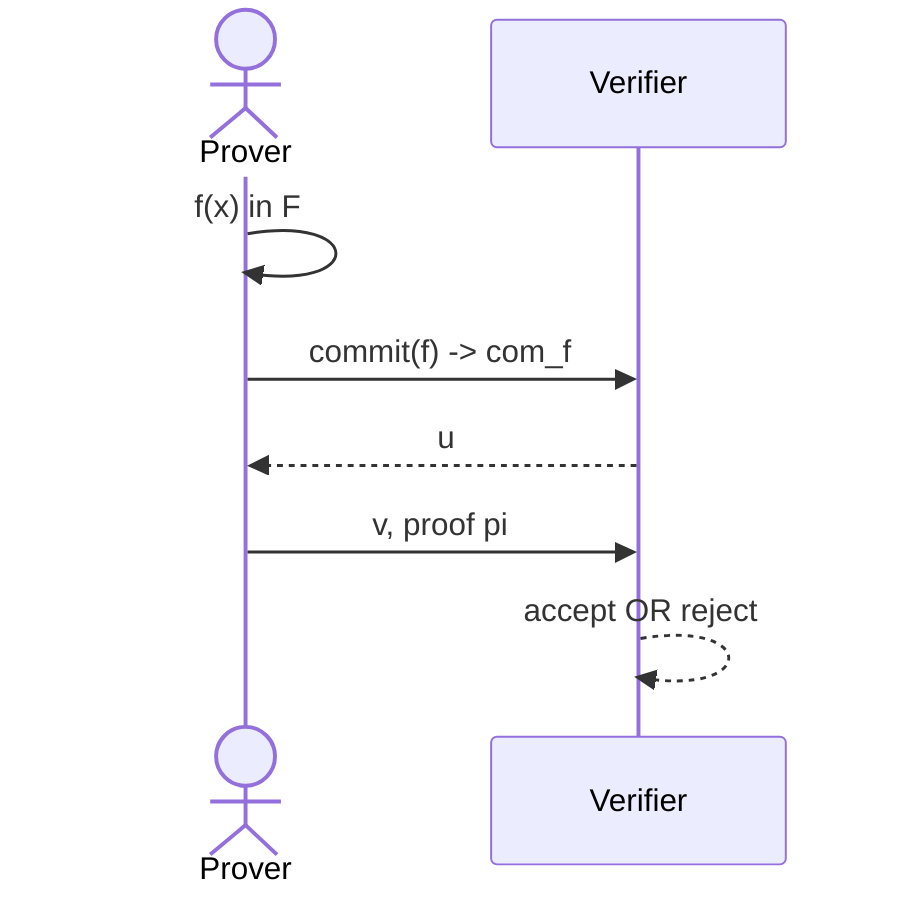

# Polynomial Commitments based on Pairing and Discrete Logarithm
Lecturer: Yupeng Zhang

## Recall
### An efficient SNARK
Polynomial Commitment scheme + Polynomial Interactive Oracle Proof (IOP) $\Rightarrow$ SNARK for general circuits

## Plonk
Univariate Polynomial Commitment + Plonk Polynomial IOP $\Rightarrow$ SNARK for general circuits

### Interactive proofs
Multivariate polynomial commitment + Sumcheck protocol $\Rightarrow$ SNARK for general circuits

### What is a polynomial commitment
First, we need to choose a family of polynomials $\mathbb{F}$

With pi a proof that $f(u) = v$ and $f \in \mathbb{F}$.

